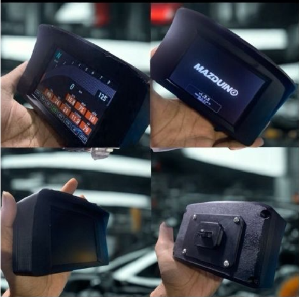
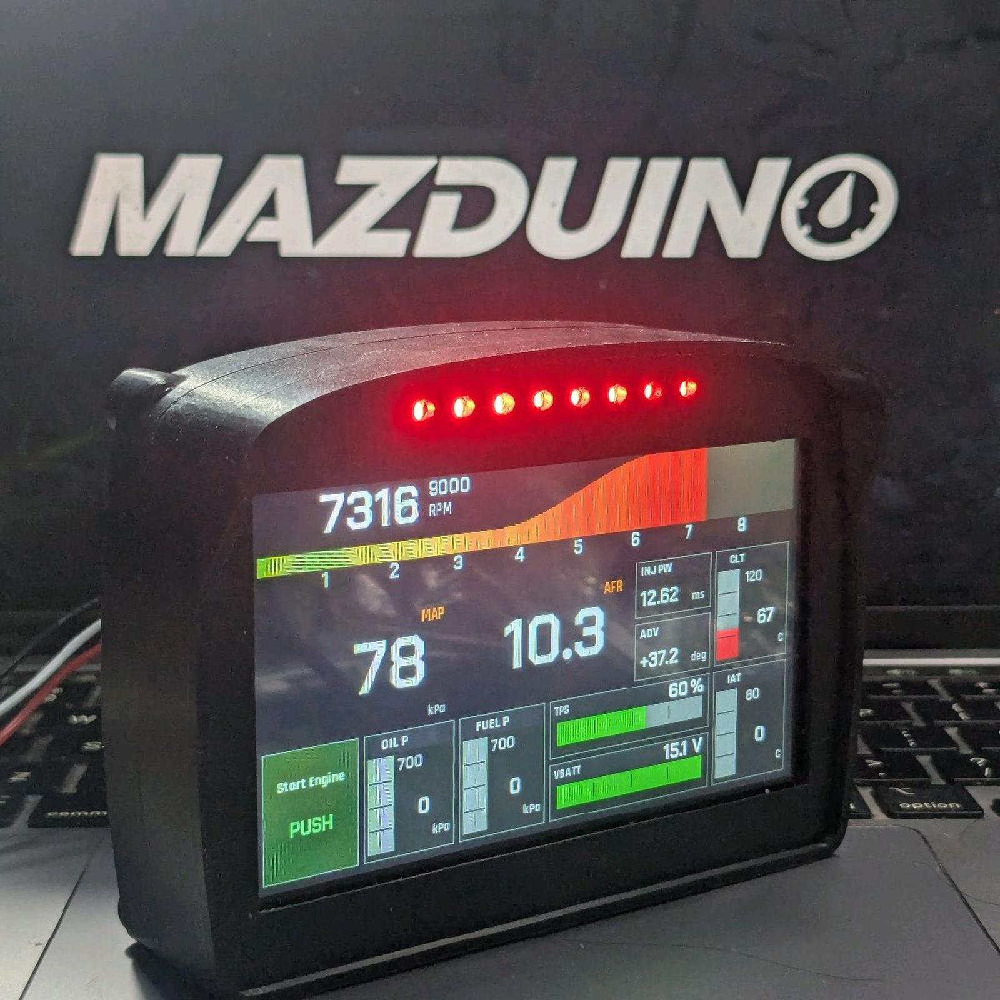

# Dokumentasi Mazduino

Selamat datang di dokumentasi resmi Mazduino. Mazduino membuat perangkat
manajemen mesin standalone open-source berbasis mikrokontroler ARM Cortex beserta
perangkat pendukungnya.

## Lini Produk

| Lini | Isi | Mulai dari |
| :--- | :--- | :--- |
| **[ECU](#ecu)** | Engine Control Unit standalone, firmware rusEFI dan Speeduino | [Mazduino LITE](mazduino-lite-v0.2.md) |
| **[Dash Display](#dash-display)** | Layar digital yang menampilkan data ECU secara real-time | [Racedash](mazduino-racedash.md) |

Baru pertama kali? Lihat **[Memulai](#memulai)** di bawah — langkahnya berbeda
untuk ECU dan untuk dash.

---

## ECU

Engine Control Unit standalone berbasis ARM Cortex, kompatibel dengan firmware
rusEFI dan Speeduino, dikonfigurasi lewat TunerStudio.

### Download Firmware ECU

> **[⬇ Download Firmware Mazduino di GitHub Releases](https://github.com/mazduino/mazduino-fw/releases)**

Setiap release sudah berisi:

- File `.hex` / `.bin` siap flash untuk setiap board
- File `.ini` TunerStudio yang matching — **selalu gunakan dari rilis yang sama dengan firmware**
- Changelog perubahan dari versi sebelumnya

Panduan lengkap cara flash dan pemilihan firmware ada di **[halaman Downloads](downloads.md)**.

> Firmware untuk Racedash terpisah dan diperbarui lewat aplikasi DashTune atau
> Mazduino Flasher — lihat halaman dash masing-masing.

---

### Model

#### Mazduino LITE

Solusi ECU compact terbaru untuk engine 4-silinder dengan Wasted Spark builtin IGBT dan fitur modern.

**Fitur Unggulan:**

- 4 channel injector + 2 channel ignition
- 168 MHz ARM Cortex-M4 processor
- Support Hall/Optical dan VR sensors
- 6 analog inputs + 5 digital inputs
- CAN Bus, USB Type-C, Serial communication
- SD card data logging
- Konektor 30-pin Microfit (2x12 + 2x3)

**Ideal untuk:**

- Engine 4-silinder (NA, Turbo, Supercharged)
- Street dan track applications
- Motorcycle high-performance
- Marine dan industrial applications

**[Dokumentasi Mazduino LITE v0.1](mazduino-lite-v0.1.md)**

**[Dokumentasi Mazduino LITE v0.2](mazduino-lite-v0.2.md)**

---

#### Mazduino Compact 4ch

Engine Control Unit 4-channel yang kompak, dirancang untuk mesin yang lebih kecil dan aplikasi dengan keterbatasan ruang.

| Mazduino Compact 4ch v1 | Mazduino Compact 4ch Latest |
|:------------------------:|:---------------------------:|
|  |  |

**Fitur Umum:**

- 4 channel injeksi
- Faktor bentuk kompak
- MCU ARM Cortex-M4 168 MHz
- Kompatibel dengan rusEFI dan Speeduino

**Versi yang Tersedia:**

- **[v1](mazduino-compact-4ch-v1.md)** - Konektor Microfit 30-pin (2x12 + 2x3)
- **[v2.1](mazduino-compact-4ch-v2.1.md)** - Konektor Yamaha 33-pin + Knock Sensor
- **[v2.2](mazduino-compact-4ch-v2.2.md)** - High Side Switching untuk alternator/VVT control
- **[v2.3-v2.4](mazduino-compact-4ch-v2.3.md)** - Pin mapping yang dioptimalkan, perbaikan knock sensor, dan RTC battery support
- **[v2.5](mazduino-compact-4ch-v2.5.md)** - Dual high side output, optimasi Hall Input, dan optimasi Analog Input

#### Mazduino Mini 6ch

Engine Control Unit 6-channel berfitur lengkap untuk kontrol injeksi sequential penuh.

| Mazduino Mini 6ch | Mazduino Mini 6ch New Case |
|:-----------------:|:--------------------------:|
|  |  |

**Fitur Umum:**

- 6 channel injeksi
- Operasi sequential penuh
- MCU ARM Cortex-M4 168 MHz
- Kemampuan I/O yang diperluas
- Kompatibel dengan rusEFI dan Speeduino

**Versi yang Tersedia:**

- **[v1.0-v1.2](mazduino-mini-6ch-v1.0-v1.2.md)** - Versi standar dengan fitur dasar
- **[v1.3](mazduino-mini-6ch-v1.3.md)** - Dengan Knock Input dan Electronic Throttle Body (ETB)
- **[v1.3B](mazduino-mini-6ch-v1.3b.md)** - MCU lebih cepat, input analog TPS2 tambahan, dan optimisasi hardware
- **[v1.3C](mazduino-mini-6ch-v1.3c.md)** - Optimisasi pin MCU, knock input tunggal, dan VDrive ignition terpisah untuk channel 1-4 dan 5-6 - **versi produksi terakhir**
- **[v1.4](mazduino-mini-6ch-v1.4.md)** - Bukan versi produksi (dokumentasi referensi); versi produksi terakhir adalah v1.3C

#### Mazduino Core

ECU generasi baru berbasis konektor otomotif 48-pin dengan arsitektur I/O yang lebih lengkap dari lini Mini 6CH, dilengkapi dual ETB, dual CAN bus, dan kombinasi input Hall + VR.

**Fitur Umum:**

- MCU ARM Cortex-M4 180 MHz
- Dual ETB (ETB1 & ETB2) dan Dual CAN Bus
- Kombinasi input Hall/Digital dan VR
- Konektor otomotif 48-pin
- Firmware rusEFI based

**[Dokumentasi Mazduino Core rev0](mazduino-core-rev0.md)**

#### Mazduino X600

ECU dengan layar 4.3 inci terintegrasi — unit dash dan ECU menjadi satu,
sehingga tidak memerlukan dash display terpisah.

**[Dokumentasi Mazduino X600](mazduino-x600.md)**

---

## Dash Display

Layar digital yang menampilkan data ECU secara real-time — RPM, gigi,
kecepatan, dan pembacaan sensor. Dash membaca data dari ECU lewat CAN Bus atau
Serial; ia tidak mengendalikan mesin.

### Mazduino Racedash

| Racedash 3.5" / 4" | Racedash Pro |
|:-------------------:|:------------:|
|  |  |

**Varian yang Tersedia:**

- **[Racedash 3.5" & 4"](mazduino-racedash.md)** — Konektor JST 4 Pin (3.5") dan DTM4 (4"/Cabus)
- **[Racedash Pro — M4, M5, M7 (4.3", 5" & 7")](mazduino-racedash-pro.md)** — Layar lebih besar, pengaturan lewat aplikasi DashTune

**ECU yang didukung:** rusEFI, Haltech, MaxxECU, Speeduino, dan OBD-II.

**Cara mengaturnya berbeda antar varian:**

- **Racedash 3.5" & 4"** — lewat browser di
  [mazduino.com/display-control](https://www.mazduino.com/display-control) atau
  lewat aplikasi **DashTune**, keduanya melalui WiFi yang dipancarkan dash.
- **Racedash Pro M4 / M5 / M7** — lewat aplikasi **DashTune** melalui Bluetooth,
  atau dari layar sentuh dash itu sendiri. Varian ini **tidak** dapat diatur
  lewat browser.

---

## Memulai

### Kalau Anda memakai ECU

1. **Pilih Model** — Pilih ECU yang sesuai dengan kebutuhan mesin dan aplikasi Anda
2. **Install Firmware** — Download dan flash firmware dari [github.com/mazduino/mazduino-fw][mazduino-fw]
3. **Konfigurasi TunerStudio** — Load file .ini yang sesuai dan atur parameter mesin
4. **Mulai Tuning** — Gunakan base map sebagai titik awal dan sesuaikan untuk aplikasi spesifik Anda

### Kalau Anda memakai Racedash

1. **Pasang dash** — Sambungkan ke ECU lewat CAN Bus atau Serial sesuai pinout di halaman varian Anda
2. **Pilih protokol ECU** — Sesuaikan dengan ECU yang dipakai; tidak perlu ganti firmware
3. **Atur tampilan** — Pilih template, data tiap panel, dan lampu peringatan lewat browser atau aplikasi DashTune

---

## Dokumentasi

### Panduan Umum
- **[Downloads](downloads.md)** - Firmware Mazduino, file .ini untuk TunerStudio, dan panduan flashing
- **[Manual TunerStudio](tunerstudio-manual.md)** - Panduan lengkap tuning dan konfigurasi ECU
- **[Tentang](about.md)** - Informasi lengkap tentang proyek Mazduino

### Dokumentasi Hardware — ECU
- **[Compact 4CH v1](mazduino-compact-4ch-v1.md)** - Spesifikasi dan wiring untuk v1
- **[Compact 4CH v2.1](mazduino-compact-4ch-v2.1.md)** - Dengan knock sensor dan konektor Yamaha
- **[Compact 4CH v2.2](mazduino-compact-4ch-v2.2.md)** - Dengan high side switching
- **[Compact 4CH v2.3](mazduino-compact-4ch-v2.3.md)** - Pin mapping dioptimalkan, knock sensor diperbaiki, RTC battery
- **[Compact 4CH v2.5](mazduino-compact-4ch-v2.5.md)** - Dual high side output, optimasi Hall Input, dan optimasi Analog Input
- **[Mini 6CH v1.0-v1.2](mazduino-mini-6ch-v1.0-v1.2.md)** - Versi standar dengan fitur dasar
- **[Mini 6CH v1.3](mazduino-mini-6ch-v1.3.md)** - Dengan knock input dan ETB support
- **[Mini 6CH v1.3B](mazduino-mini-6ch-v1.3b.md)** - MCU upgrade, optimisasi hardware dan input analog tambahan
- **[Mini 6CH v1.3C](mazduino-mini-6ch-v1.3c.md)** - Optimisasi pin MCU, knock input tunggal, dan VDrive ignition terpisah - **versi produksi terakhir**
- **[Mini 6CH v1.4](mazduino-mini-6ch-v1.4.md)** - Bukan versi produksi; versi produksi terakhir adalah v1.3C
- **[Mazduino Core rev0](mazduino-core-rev0.md)** - Konektor 48-pin, dual ETB, dual CAN bus
- **[Mazduino Core rev1](mazduino-core-rev1.md)** - Revisi terbaru lini Core
- **[Mazduino X600](mazduino-x600.md)** - ECU dengan layar 4.3 inci terintegrasi

### Dokumentasi Hardware — Dash Display
- **[Mazduino Racedash 3.5" & 4"](mazduino-racedash.md)** - Dash display konektor JST 4 Pin dan DTM4
- **[Mazduino Racedash Pro](mazduino-racedash-pro.md)** - Varian layar 4.3", 5", dan 7" (M4, M5, M7)

---

## Dukungan

Untuk dukungan teknis, pertanyaan, atau kontribusi, silakan kunjungi forum komunitas kami atau repositori GitHub.

## PCB Design dan Technical Resources

Untuk informasi detail mengenai PCB design, schematic, dan Bill of Materials (BOM) untuk perangkat keras Mazduino, silakan kunjungi:

**[Mazduino Wiki][mazduino-hw]**

[mazduino-fw]: https://github.com/mazduino/mazduino-fw
[mazduino-hw]: https://github.com/mazduino/mazduino/wiki

Wiki ini berisi:

- Schematic lengkap untuk semua versi
- PCB layout dan routing details
- Bill of Materials (BOM) dengan part numbers
- Assembly notes dan manufacturing guidelines
- Design considerations dan engineering decisions
- Revision history dan changelog detail
