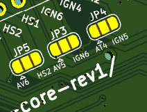
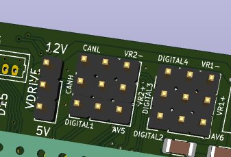

# Mazduino Core Rev1

## Gambaran Umum

Mazduino Core Rev1 adalah revisi lanjutan dari [Mazduino Core Rev0](mazduino-core-rev0.md), ECU berbasis konektor otomotif 48-pin dengan arsitektur I/O yang lebih lengkap dari lini Mini 6CH. Produk ini menggunakan **ARM Cortex-M4 180 MHz** sebagai MCU utama untuk kebutuhan kontrol mesin advanced, termasuk dukungan **dual ETB**, **dual CAN bus**, kombinasi input **Hall + VR**, serta output aktuator yang lebih banyak untuk mesin modern.

Rev1 membawa sejumlah perbaikan dibanding Rev0, di antaranya penambahan **12V Out** untuk suplai sensor (pin 17, misalnya untuk CKP/CMP sensor yang membutuhkan power 12V), perbaikan **5V sensor supply** yang kini sanggup hingga **3A** dan tidak mudah panas, penamaan jalur jumper opsional (CON21, CON22, CON37, CON38), serta penambahan opsi jumper baru pada pin 21 dan pin 37. Lihat bagian [Perubahan pada Rev1](#perubahan-pada-rev1) untuk ringkasan lengkap.

Dokumentasi ini disusun berdasarkan spesifikasi produk Mazduino Core dan referensi hardware pada dokumen MAZDUINO CORE.


## Fitur Utama

- MCU **ARM Cortex-M4 180 MHz**
- Built-in **5V sensor supply** hingga **3A** dengan proteksi internal, lebih tahan panas dibanding Rev0
- Built-in **12V sensor supply** (pin 17) untuk sensor yang membutuhkan power 12V, misalnya sensor CKP/CMP tipe 12V
- **4x input Hall/Digital** untuk CKP, CMP, VSS, clutch, launch, atau switch lainnya (seluruhnya memiliki opsi jumper alternatif)
- **11x input analog** untuk MAP, TPS, O2, tekanan, temperatur, PPS, dan sensor tambahan
- **6x output ignition** (untuk smart coil, 5V/12V sesuai konfigurasi)
- **10x output low side 3A** untuk injektor, idle PWM, boost, VVT, dan aktuator beban menengah
- **5x output low side low current** untuk relay (main relay, fuel pump, fan, AC, tach)
- **2x output high side 1.3A** untuk beban 12V switching
	- Contoh penggunaan: **alternator control**, solenoid 12V, dan aktuator switching lain sesuai batas arus.

- **2x CAN bus** (tergantung konfigurasi jalur/jumper)
- **2x input VR** untuk CKP/CMP tipe variable reluctor
- **2x ETB output** (ETB1 dan ETB2)
- **Dual IC ETB (ETB1 dan ETB2)** dapat juga digunakan untuk kontrol **Idle Stepper**
- Komunikasi USB, Serial, dan CAN
- Dukungan firmware **rusEFI based** saja (official atau custom firmware dengan MCU F4)

## Perubahan pada Rev1

Dibanding Rev0, perbaikan/perubahan pada Rev1 adalah sebagai berikut:

| Pin | Rev0 | Rev1 | Keterangan |
|-----|------|------|------------|
| 4 (JP3) | AVS2 (Analog Volt 5) atau Ignition 6 | AVS5 (Analog Volt 5) atau Ignition 6 | Penamaan opsi jumper diperbarui, sinyal tetap Analog Volt 5 |
| 5 (JP5) | AVS3 (Analog Volt 6) atau High Side 2 | AVS6 (Analog Volt 6) atau High Side 2 | Penamaan opsi jumper diperbarui, sinyal tetap Analog Volt 6 |
| 6 | 5V Sensor Supply | 5V Sensor Supply (hingga **3A**) | Kapasitas arus suplai 5V diperbesar, lebih tahan panas dibanding Rev0 |
| 17 | Ground (Ground power) | **12V Out** (Sensor 12V power) | Pin baru untuk suplai 12V sensor, misalnya CKP/CMP sensor tipe 12V; bukan lagi ground |
| 20 (JP4) | ATS2 (Analog Temp 4) atau Ignition 5 | ATS4 (Analog Temp 4) atau Ignition 5 | Penamaan opsi jumper diperbarui, sinyal tetap Analog Temp 4 |
| 21 | Digital 1 (tetap) | **CON21**: Digital 1 atau AV5 (Analog Volt 5) — Jumper Option | Pin 21 kini punya opsi jumper tambahan ke Analog Volt 5 |
| 22 | IN22: Digital 3 atau VR1+ | **CON22**: Digital 3 atau VR1+ | Penamaan pin diperbarui, fungsi tetap sama |
| 37 | Digital 2 (tetap) | **CON37**: Digital 2 atau AVS6 (Analog Volt 6) — Jumper Option | Pin 37 kini punya opsi jumper tambahan ke Analog Volt 6 |
| 38 | IN38: Digital 4 atau VR1- | **CON38**: Digital 4 atau VR1- — Jumper Option | Penamaan pin diperbarui, fungsi tetap sama |
| 41 | Analog Volt 8 | Analog Volt 5 | Kanal Analog Volt 8 dihapus, pin 41 kini membawa Analog Volt 5 secara langsung |

> **Perhatian:** Pin 17 pada Rev1 berubah fungsi dari **Ground** menjadi **12V Out** (suplai 12V untuk sensor). Jangan menyambungkan pin 17 sebagai ground saat migrasi harness dari Rev0 ke Rev1 — gunakan pin 18, 39, atau 40 untuk ground.

## Konfigurasi Hardware dan Jumper

Mazduino Core memiliki beberapa pin yang dapat dialihkan fungsinya melalui jumper solder. Konsep ini memberi fleksibilitas agar satu board bisa dipakai untuk berbagai konfigurasi mesin.

### Posisi Jumper Solder JP3, JP4, dan JP5



Posisi pin **JP3**, **JP4**, dan **JP5** berada di bagian bawah board dengan model solder jumper.

Dibagian belakang board ada jumper yang bisa disesuaikan kebutuhan atau permintaan diawal pesanan. ingin digunakan untuk mobil dengan 6 silinder atau hanya 4 silinder. Atau butuh ekstra analog input atau high side output (12v switching).

Solder Jumper 2 pin ke tengah untuk meneruskan ke konektor ECU pada JP3, JP4 dan JP5.

### Pin Header Jumper Tanpa Solder



Pin header jumper tanpa solder sesuai permintaan saat awal pesanan atau dapat dipindahkan sendiri sesuai kebutuhan. Konektor ECU akan mengeluarkan CANL atau VR2-, Digital 4 atau VR1-, CANH atau VR2+, Digital 3 atau VR1+ (pin IN33/IN34/CON22/CON38).

Selain itu, pada Rev1 pin **CON21** (Digital 1 atau AV5) dan **CON37** (Digital 2 atau AVS6) juga menggunakan model pin header jumper tanpa solder yang sama.

### Pin Header Tambahan (Prototype)

Untuk kebutuhan prototype, tersedia 4 buah pin header 6 pin yang bisa menggunakan konektor **JST XH 2.54**.

| Header | Pinout |
|--------|--------|
| J2 | 5V, Analog Temp 4, Analog Volt 2, Analog Volt 3, GND, GND |
| J5 | 12V, CANL1, CANH1, CANL2, CANH2, GND |
| J6 | 5V, 5V, 5V, USB D-, USB D+, GND |
| J7 | 3.3V, 3.3V, 3.3V, 3.3V, GND |

### Jumper Ignition Volt Drive (12V / 5V)

Jumper **Ignition Volt Drive** digunakan untuk memilih level tegangan trigger sinyal coil, yaitu **12V** atau **5V**.

Harap berhati-hati dan pastikan tegangan sinyal coil sesuai. Jika level tegangan tidak sesuai, coil dapat rusak dan tidak dapat digunakan lagi.

### Catatan ETB dan Idle Stepper

Karena terdapat dual IC untuk kontrol **ETB1** dan **ETB2**, jalur driver tersebut juga dapat dimanfaatkan untuk kontrol **Idle Stepper** sesuai konfigurasi firmware dan wiring.

### Opsi Jumper Penting

- **JP3 (Pin 4)**: pilih **AVS5 (Analog Volt 5)** atau **Ignition 6**

- **JP4 (Pin 20)**: pilih **ATS4 (Analog Temp 4)** atau **Ignition 5**

- **JP5 (Pin 5)**: pilih **AVS6 (Analog Volt 6)** atau **High Side 2**

- **CON21 (Pin 21)**: pilih **Digital 1** atau **AV5 (Analog Volt 5)**

- **CON22 (Pin 22)**: pilih **Digital 3** atau **VR1+**

- **CON37 (Pin 37)**: pilih **Digital 2** atau **AVS6 (Analog Volt 6)**

- **CON38 (Pin 38)**: pilih **Digital 4** atau **VR1-**

- **IN33 (Pin 33)**: pilih **CANH1** atau **VR2+**

- **IN34 (Pin 34)**: pilih **CANL1** atau **VR2-**

### Catatan Konfigurasi

- Untuk setup **6 ignition penuh**, aktifkan mode ignition pada Pin 4 dan Pin 20.
- Untuk setup yang butuh analog ekstra, aktifkan mode analog di Pin 4/5/20/21/37.
- Untuk sensor trigger VR, pindahkan jalur Digital 3/4 atau CANH/CANL ke VR sesuai kebutuhan.
- Selalu matikan sumber daya ECU sebelum mengubah konfigurasi jumper.

## Wiring dan Instalasi


### Layout Konektor 48-pin

```
 1   2   3   4   5   6   7   8   9  10  11  12  13  14  15  16
17  18  19  20  21  22  23  24  25  26  27  28  29  30  31  32
33  34  35  36  37  38  39  40  41  42  43  44  45  46  47  48
```

### Pin Assignment Konektor ECU 48-pin

| Pin | Fungsi | Keterangan |
|-----|--------|------------|
| 1 | 12V ECU | Catu daya utama ECU |
| 2 | Ignition 1 | Output pengapian 1 |
| 3 | High Side 1 | Output high side 1.3A untuk 12V switching (contoh: alternator control) |
| 4 | OUT4 (JP3) | Pilih AVS5 (Analog Volt 5) atau Ignition 6 |
| 5 | OUT5 (JP5) | Pilih AVS6 (Analog Volt 6) atau High Side 2 untuk 12V switching |
| 6 | 5V Sensor Supply | Referensi 5V sensor, hingga 3A |
| 7 | ETB1+ | Output ETB 1 positif |
| 8 | ETB1- | Output ETB 1 negatif |
| 9 | ETB2+ | Output ETB 2 positif |
| 10 | ETB2- | Output ETB 2 negatif |
| 11 | Low Side 10 | Output low side 3A |
| 12 | Low Side 9 | Output low side 3A |
| 13 | Low Side 8 | Output low side 3A |
| 14 | Low Side 7 | Output low side 3A |
| 15 | Low Side 6 | Output low side 3A |
| 16 | Low Side 5 | Output low side 3A |
| 17 | 12V Out | Sensor 12V power, misalnya untuk CKP/CMP sensor tipe 12V |
| 18 | Ground | Ground power |
| 19 | Ignition 2 | Output pengapian 2 |
| 20 | OUT20 (JP4) | Pilih ATS4 (Analog Temp 4) atau Ignition 5 |
| 21 | CON21 | Pilih Digital 1 atau AV5 (Analog Volt 5) |
| 22 | CON22 | Pilih Digital 3 atau VR1+ |
| 23 | Analog Temp 1 | Input temperatur |
| 24 | Analog Temp 2 | Input temperatur |
| 25 | Analog Volt 7 | Input analog 0-5V |
| 26 | Analog Temp 3 | Input temperatur |
| 27 | Low Side LC 15 | Output low current |
| 28 | Low Side LC 14 | Output low current |
| 29 | Low Side LC 13 | Output low current |
| 30 | Low Side LC 12 | Output low current |
| 31 | Low Side LC 11 / RPM | Output low current / tach |
| 32 | Low Side 4 | Output low side 3A |
| 33 | IN33 | Pilih CANH1 atau VR2+ |
| 34 | IN34 | Pilih CANL1 atau VR2- |
| 35 | Ignition 3 | Output pengapian 3 |
| 36 | Ignition 4 | Output pengapian 4 |
| 37 | CON37 | Pilih Digital 2 atau AVS6 (Analog Volt 6) |
| 38 | CON38 | Pilih Digital 4 atau VR1- |
| 39 | Ground | Ground |
| 40 | Ground | Ground |
| 41 | Analog Volt 5 | Input analog 0-5V |
| 42 | Analog Volt 1 | Input analog 0-5V |
| 43 | Analog Volt 2 | Input analog 0-5V |
| 44 | Analog Volt 3 | Input analog 0-5V |
| 45 | Analog Volt 4 | Input analog 0-5V |
| 46 | Low Side 3 | Output low side 3A |
| 47 | Low Side 2 | Output low side 3A |
| 48 | Low Side 1 | Output low side 3A |

## Ringkasan Jumlah I/O

| Kelompok | Jumlah | Keterangan |
|----------|--------|------------|
| Input Hall/Digital | 4 | Digital 1, 2, 3, 4 (seluruhnya memiliki opsi jumper alternatif ke AV/VR) |
| Input VR | 2 | VR1 (+/-) dan VR2 (+/-) melalui jalur jumper |
| Input Analog | 11 | Analog Volt (1-7) + Analog Temp (1-4) termasuk pin opsi jumper |
| Ignition Output | 6 | Ignition 1-6 (5/6 via jumper) |
| Low Side 3A | 10 | Lowside 1-10 |
| Low Side Low Current | 5 | LC 11-15 |
| High Side 1.3A | 2 | High Side 1 + High Side 2 (via jumper), dapat dipakai untuk 12V switching seperti alternator control |
| ETB Output | 2 set | ETB1 (+/-), ETB2 (+/-) |
| CAN Bus | 2 | CAN1 via pin jumper; CAN2 sesuai konfigurasi board/firmware |

## Mapping Fungsional Firmware

Berikut mapping fungsi umum untuk setup firmware. Assignment dapat disesuaikan dengan kebutuhan mesin dan strategi tuning.

| Fungsi Umum | Jalur Default |
|------------|---------------|
| Ignition 1-6 | Ign 1 sampai Ign 6 |
| Injector 1-10 | Low Side 1 sampai Low Side 10 |
| Main Relay / Fuel Pump / Fan / AC / Tacho | Low Side Low Current 11 sampai 15 |
| MAP / TPS / O2 / PPS / Sensor tekanan | Analog Volt 1 sampai 7 |
| CLT / IAT / Temp tambahan | Analog Temp 1 sampai 4 |
| CKP / CMP Hall | Digital 1 dan Digital 2 |
| CKP / CMP VR | VR1 dan VR2 (melalui konfigurasi jumper) |
| ETB1 | ETB1+ dan ETB1- |
| ETB2 | ETB2+ dan ETB2- |

## Contoh Skenario Penggunaan I/O

Jalur Low Side, Analog Volt, dan Analog Temp bersifat generik sehingga alokasinya tergantung konfigurasi mesin dan mode ignition yang dipakai. Beberapa contoh skenario:

- **Low Side sebagai injector**: Low Side 1 sampai 8 dapat dipakai sebagai output injector untuk mesin **8 silinder full sequential** (1 injector per channel). Untuk mesin dengan jumlah silinder lebih sedikit atau mode **batch/semi-sequential**, jumlah Low Side yang dipakai untuk injector menyesuaikan (sisanya bebas dipakai untuk idle PWM, boost, VVT, atau aktuator lain).
- **Ignition mode Wasted Spark**: dipakai untuk mesin **8 silinder ke atas**, dengan **4 channel ignition** (masing-masing coil melayani sepasang silinder). Untuk mesin **6 silinder ke bawah**, ignition dapat dipasang **individual/COP** (1 channel per silinder) karena board menyediakan hingga 6 channel ignition. Channel ignition yang tidak terpakai dapat dialihkan lewat jumper (Pin 4/Pin 20) menjadi Analog Volt 5 / Analog Temp 4 sesuai kebutuhan sensor tambahan.
- **Analog Volt**: dipakai untuk input sensor analog 0-5V seperti **MAP**, **TPS**, **O2/wideband**, **PPS**, atau sensor tekanan lain.
- **Analog Temp**: dipakai untuk input sensor temperatur seperti **CLT (Coolant Temp)** dan **IAT (Intake Air Temp)**.

## Informasi MCU

- **MCU**: ARM Cortex-M4 180 MHz

- ETB control lines pada firmware biasanya dipetakan ke pin MCU khusus (DIR/DIS/PWM) sesuai package firmware.
- Gunakan file konfigurasi firmware yang memang ditujukan untuk **Mazduino Core Rev1** agar semua pin berfungsi sesuai desain board.
- Firmware untuk board ini hanya untuk **rusEFI based** (baik official maupun custom firmware dengan MCU F4).

## Panduan Instalasi Singkat

1. Pastikan semua ground utama (pin 18/39/40) terhubung baik.
2. Hubungkan pin 1 ke suplai 12V ECU yang stabil.
3. Jika membutuhkan suplai 12V untuk sensor (misalnya sensor CKP/CMP tipe 12V), gunakan pin 17 (**12V Out**) — jangan disambung sebagai ground.
4. Konfigurasikan jumper dulu sebelum ECU dipasang ke harness final.
5. Pilih mode trigger Hall atau VR sesuai jenis sensor CKP/CMP.
6. Jika menggunakan 6 ignition, aktifkan opsi ignition pada pin jumper terkait.
7. Jika menggunakan ETB ganda, verifikasi wiring ETB1 dan ETB2 serta kalibrasi TPS/PPS.
8. Lakukan pengecekan output dengan test mode di TunerStudio/rusEFI sebelum start engine.

## Catatan Penting

- **Pin 17 berubah fungsi dibanding Rev0**: dari **Ground** menjadi **12V Out** (suplai 12V untuk sensor, misalnya CKP/CMP tipe 12V). Periksa ulang harness saat migrasi dari Rev0 ke Rev1.
- **5V Sensor Supply** (pin 6) pada Rev1 sanggup hingga **3A** dan lebih tahan panas dibanding Rev0, sehingga lebih aman untuk banyak sensor 5V sekaligus.
- Output ignition ditujukan untuk **smart coil**. Untuk dumb coil wajib menggunakan driver/IGBT eksternal.
- Jalur output low current dipakai untuk relay atau beban ringan, bukan beban motor langsung.
- **HS1 dan HS2** dapat digunakan sebagai output **12V switching**, misalnya untuk **alternator control**.
- Pastikan setting **Ignition Volt Drive** (12V/5V) sesuai spesifikasi coil sebelum menyalakan sistem.
- Semua perubahan jumper harus dilakukan saat ECU **tanpa daya**.
- Untuk pemanfaatan **CAN2**, ikuti skema hardware dan konfigurasi firmware yang sesuai revisi board.

## Software Tuning

- Download TunerStudio: [TunerStudio Downloads][tunerstudio-dl]

- Referensi firmware rusEFI: [wiki.rusefi.com][rusefi-wiki]

- Informasi produk: [www.mazduino.com][mazduino-site]

[tunerstudio-dl]: https://www.tunerstudio.com/index.php/downloads
[rusefi-wiki]: https://wiki.rusefi.com
[mazduino-site]: https://www.mazduino.com
