# Mazduino Racedash Pro

## Gambaran Umum


*Racedash Pro M4 (4.3") — delapan LED shift light di atas layar, dengan
Template 1 dan sebuah CAN button "Start Engine"*

Mazduino Racedash Pro adalah varian dash display digital dengan layar berukuran lebih besar, tersedia dalam pilihan **4.3", 5", dan 7"**. Berbeda dengan varian [Mazduino Racedash](mazduino-racedash.md) (3.5" dan 4") yang dikonfigurasi melalui WiFi dan browser, Racedash Pro dapat diatur **langsung dari layar (touchscreen)** tanpa perlu terhubung ke HP/laptop. Pada generasi M4/M5/M7, tersedia juga aplikasi Android **DashTune** lewat Bluetooth untuk pengaturan yang tidak ada di menu layar.

| Varian | Ukuran Layar | Konektor |
| :---- | :---- | :---- |
| Racedash Pro 4.3" (M4) | 4.3 inch | DTM4 (Deutsch DTM 4 Pin) |
| Racedash Pro 5" (M5) | 5 inch | DTM4 (Deutsch DTM 4 Pin) |
| Racedash Pro 7" (M7) | 7 inch | DTM4 (Deutsch DTM 4 Pin) |

> **Dua generasi firmware**: Racedash Pro hadir dalam dua generasi. Keduanya
> memakai bodi, layar, dan konektor yang sama — yang berbeda adalah tampilan
> dan cara mengaturnya.
>
> - **Generasi M4 / M5 / M7** — punya beberapa pilihan tampilan (template) yang
>   bisa digeser, dan bisa diatur dari HP lewat aplikasi **DashTune** selain
>   dari layar. Panduannya ada di bagian
>   [Racedash Pro M4 / M5 / M7](#racedash-pro-m4-m5-m7).
> - **Generasi lama** — seluruh pengaturan dilakukan dari layar sentuh.
>   Halamannya bernama *Main*, *Bench Test*, *Warning Setting*, *Slot Setting*,
>   *Display Setting*, dan *Connection Setting*. Panduannya ada di bagian
>   [Pengaturan via Touchscreen (firmware lama)](#pengaturan-via-touchscreen-firmware-lama)
>   di akhir halaman ini.
>
> Cara membedakannya paling mudah: kalau dashboard-mu bisa **digeser
> kiri-kanan** untuk berganti tampilan, berarti generasi M4/M5/M7.

## Fitur Utama

- Layar sentuh (touchscreen) sehingga pengaturan dashboard bisa dilakukan langsung di layar, tanpa aplikasi atau koneksi WiFi tambahan
- Menampilkan RPM, gear indicator, kecepatan, dan data sensor lain secara real-time
- Mendukung komunikasi ke ECU melalui **CAN Bus** atau **Serial**, tergantung ECU yang digunakan. ECU berbasis **Speeduino** menggunakan mode Serial, sedangkan **rusEFI**, **Haltech**, dan **MaxxECU** menggunakan mode CAN Bus
- Tersedia halaman **Bench Test** khusus untuk ECU **rusEFI**

## Fitur via WiFi

Meskipun sebagian besar pengaturan Racedash Pro dilakukan langsung dari touchscreen, ada beberapa fitur yang tetap memerlukan koneksi WiFi ke situs Mazduino, yaitu update firmware dan custom splash screen.

> **Untuk generasi M4 / M5 / M7**, update firmware dan splash screen dilakukan
> lewat aplikasi **DashTune** di HP, bukan melalui situs Mazduino. Langkahnya
> ada di [Panduan Aplikasi DashTune](#panduan-aplikasi-dashtune). Cara di bawah
> ini berlaku untuk firmware generasi lama.

### Update Firmware (USB atau OTA)

Update firmware Racedash Pro dapat dilakukan dengan dua cara:

1. **USB** — membuka case Racedash Pro, lalu menghubungkan port/pin USB TTL internal ke komputer secara langsung.
2. **OTA (Over-The-Air)** — melalui WiFi menggunakan **Mazduino Flasher** pada **[mazduino.com/dashboard/flasher](https://www.mazduino.com/dashboard/flasher)**, tanpa perlu membuka case. Hubungkan HP/laptop ke WiFi yang dipancarkan oleh Racedash Pro (atau pastikan berada di jaringan WiFi yang sama), lalu pilih model Racedash Pro yang sesuai pada **Select Device** — **pastikan device dipilih dengan benar** — sebelum klik **Start Flashing**.

### Custom Splash Screen

Racedash Pro mendukung splash screen (gambar/logo) custom yang tampil saat perangkat baru menyala. Splash screen dibuat melalui **Splash Screen Generator** dan diunggah ke Racedash Pro melalui WiFi.

1. Buka **[mazduino.com/splash-generator](https://www.mazduino.com/splash-generator)** melalui browser HP/laptop.
2. Buat splash screen sesuai keinginan mengikuti instruksi pada halaman tersebut.
3. Unggah hasilnya ke Racedash Pro melalui koneksi WiFi yang dipancarkan oleh device.

## Konektor DTM4 / 4 Pin

Racedash Pro menggunakan konektor **DTM4 (Deutsch DTM 4 Pin)** yang sama dengan varian [Racedash 4"](mazduino-racedash.md#racedash-4-cabus-konektor-dtm4), baik dari sisi bentuk fisik konektor maupun fungsi pin.

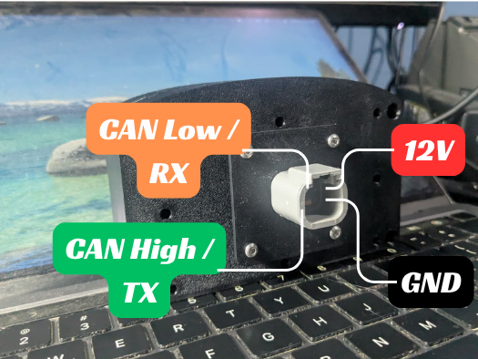

*Dash connector side*

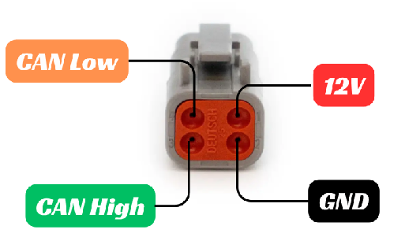

*Cable connector side*

| No. Pin | Deskripsi |
| :---- | :---- |
| 1 | 12V Power Supply |
| 2 | Ground |
| 3 | CAN High / TX |
| 4 | CAN Low / RX |

**Catatan:**

- Pin 3 dan 4 berfungsi sebagai **CAN High/CAN Low** untuk ECU **rusEFI**, **Haltech**, dan **MaxxECU** (mode CAN Bus).
- Khusus untuk ECU **Speeduino**, pin 3 dan 4 berfungsi sebagai **TX/RX Serial**, karena Speeduino tidak memiliki CAN Bus native.

## Racedash Pro M4 / M5 / M7

Bagian ini khusus untuk generasi M4 (4.3"), M5 (5"), dan M7 (7"). Konektor dan
pemasangan kabelnya sama persis dengan yang dijelaskan di
[Konektor DTM4 / 4 Pin](#konektor-dtm4-4-pin) di atas.

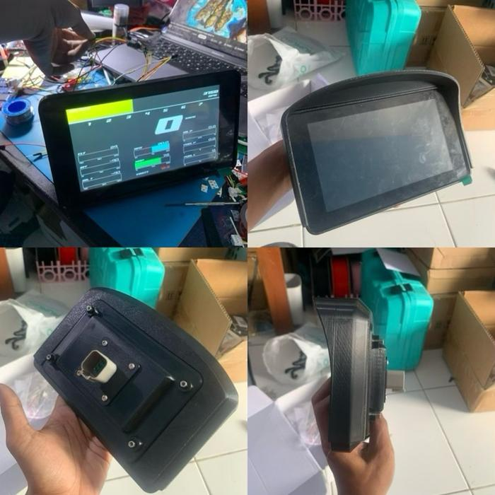

*Racedash Pro M7 (7") — tampak depan saat menyala, tampak depan, sisi belakang
beserta dudukannya, dan tampak samping*

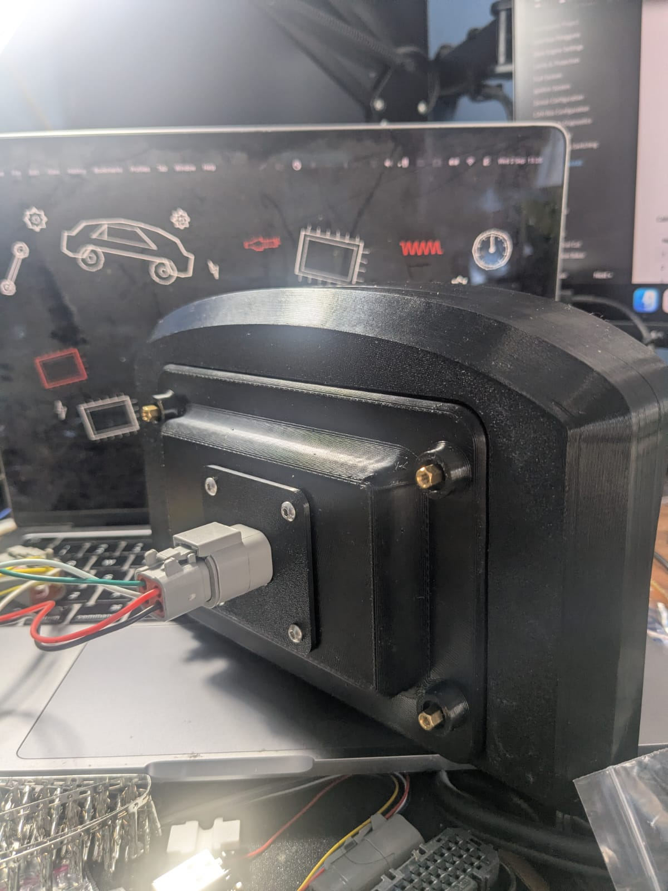

*Sisi belakang dengan konektor terpasang*

### ECU yang didukung

| ECU | Cara sambung | Catatan |
| :---- | :---- | :---- |
| rusEFI | CAN Bus 500 kbps | Paling lengkap datanya |
| Haltech | CAN Bus 1 Mbps | Satu-satunya yang mengirim data lampu sein, rem tangan, dan tekanan ban |
| MaxxECU | CAN Bus 500 kbps | |
| Speeduino | Serial | Speeduino tidak punya CAN, jadi pin 3 dan 4 dipakai sebagai TX/RX |
| OBD-II | CAN Bus (ISO 15765-4) | Untuk ECU standar bawaan mobil — [baca batasannya](#batasan-obd-ii) |

Tipe ECU dipilih dari aplikasi DashTune atau dari menu di layar, dan **tidak
perlu ganti firmware**. Kecepatan CAN mengikuti ECU yang dipilih secara
otomatis.

Data yang tampil di semua ECU: RPM, MAP, TPS, timing pengapian, duty injektor,
AFR/lambda, tekanan dan suhu (air, oli, bahan bakar, udara masuk), EGT 1–4,
gigi, kadar etanol, dan tegangan aki.

> **Catatan**: Lampu **sein**, **rem tangan**, dan **tekanan ban** hanya
> menyala kalau memakai **Haltech**, karena hanya Haltech yang mengirimkan
> datanya. Pada rusEFI dan MaxxECU ketiga lampu itu memang tidak akan menyala —
> bukan kerusakan.

#### Batasan OBD-II

> **Tidak semua mobil OBD-II dapat dibaca dash ini, dan kami tidak menjamin
> mobil Anda termasuk yang bisa.** Pastikan hal berikut sebelum membeli untuk
> keperluan OBD-II.

Yang didukung hanya **OBD-II di atas CAN Bus**, yaitu **ISO 15765-4** dengan
**identifier 11-bit** (dash mengirim permintaan ke ID `0x7DF` dan membaca
jawaban di `0x7E8`–`0x7EF`), pada kecepatan **500 kbps** atau **250 kbps**.

Yang **tidak** didukung:

| Protokol | Keterangan |
| :---- | :---- |
| ISO 9141-2 | K-line, umum pada mobil lama |
| ISO 14230-4 (KWP2000) | K-line |
| SAE J1850 PWM / VPW | Umum pada mobil Amerika lama |
| ISO 15765-4 identifier 29-bit | Varian CAN yang dipakai sebagian kendaraan |

Secara umum, mobil produksi **2008 ke atas** di banyak pasar sudah memakai
OBD-II di atas CAN, tetapi ini bukan jaminan — tahun peralihan berbeda-beda
antar merek dan negara.

Meski protokolnya cocok, data yang muncul **bergantung pada apa yang direspons
mobil Anda**. Dash menanyakan dulu PID mana yang didukung, lalu hanya membaca
yang dijawab. PID yang dibaca: RPM, kecepatan, TPS, MAP, suhu coolant, suhu udara
masuk, engine load, tegangan, dan suhu oli. Banyak
mobil tidak menjawab sebagian di antaranya — suhu oli termasuk yang paling
sering tidak tersedia.

OBD-II juga lebih lambat dibanding protokol CAN khusus ECU standalone, karena
dash harus bertanya lalu menunggu jawaban untuk tiap nilai, bukan menerima
broadcast berkala.

### Mengganti tampilan (template)

Dash menyediakan beberapa tampilan dashboard. Untuk berpindah, **geser kiri
atau kanan di bagian atas layar** (di area bar RPM). Bagian bawah layar sengaja
tidak menerima geseran supaya tombol CAN tidak ikut tersentuh.

Tampilan terakhir yang dipakai akan diingat, jadi saat dinyalakan lagi dash
langsung membuka tampilan yang sama.

Beberapa contoh tampilan pada Racedash Pro M7:

<!-- A flex row rather than a table: a two-column table gives each cell a fixed
     share of the width and the images do not shrink to fit it, so the second
     column was being cut off. These wrap and scale instead. -->
<div style="display:flex;flex-wrap:wrap;gap:12px;margin:16px 0">
  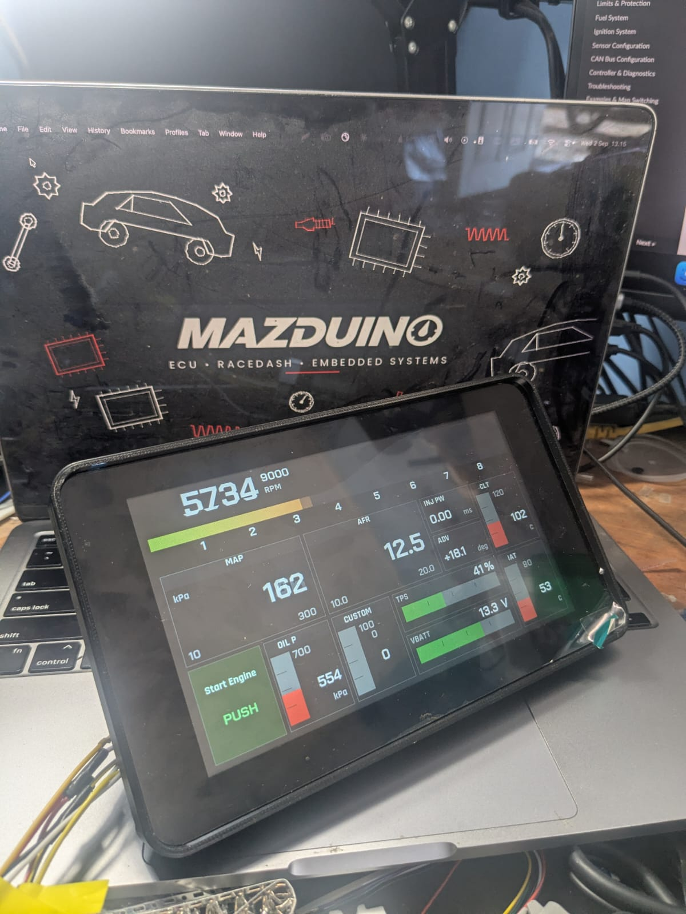
  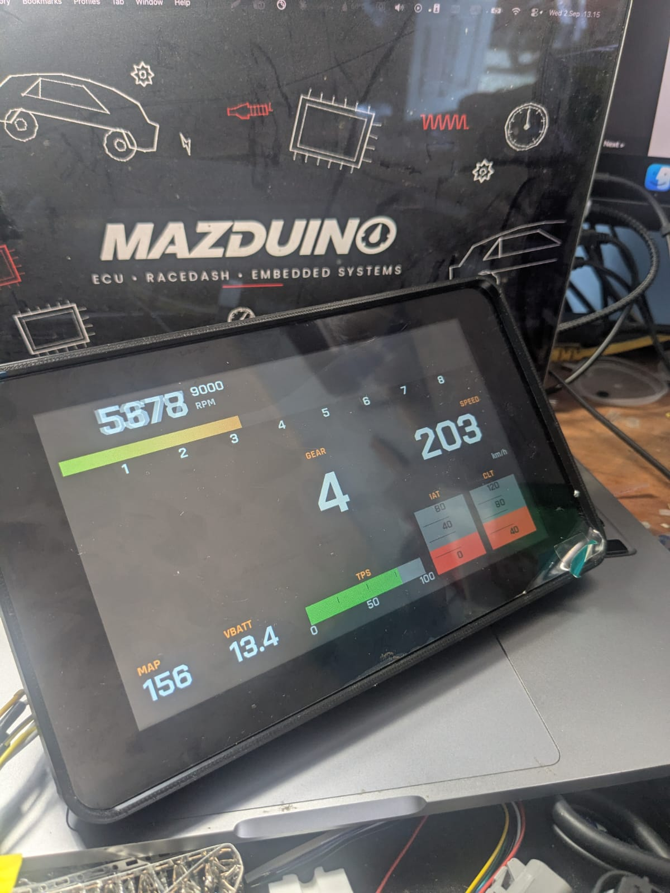
  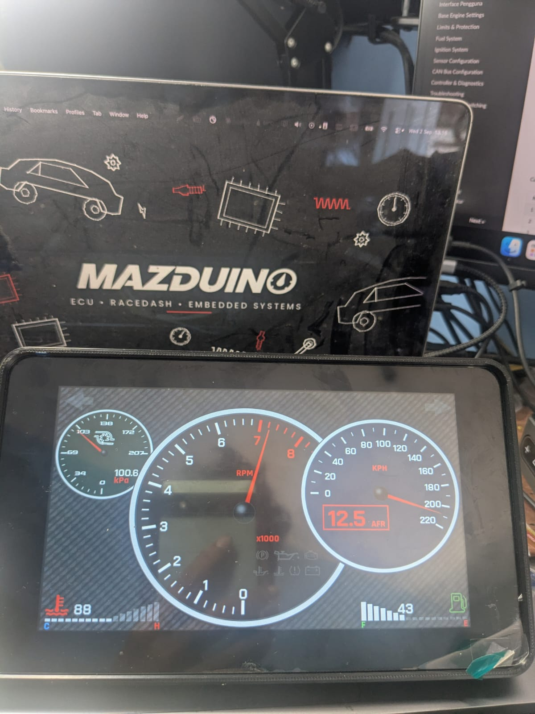
  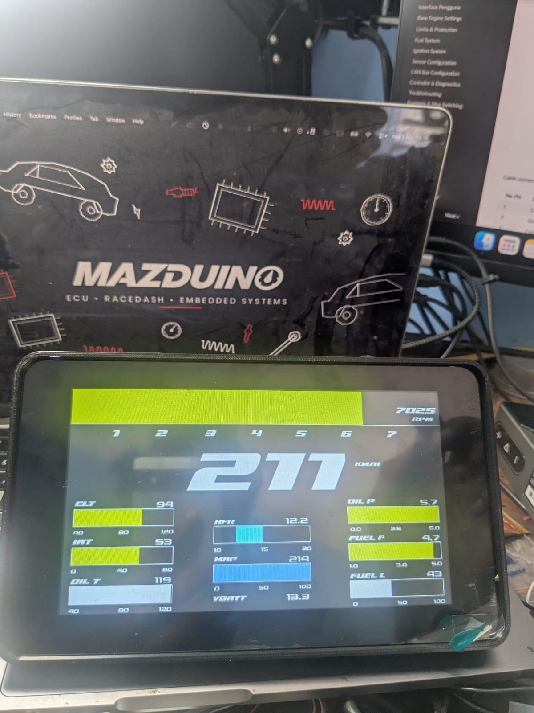
</div>

Warna gauge dan isi tiap panel dapat diubah, jadi tampilan di dash Anda bisa
berbeda dari contoh di atas.

### Menu di layar (M4 / M5 / M7)

Menu firmware ini berbeda sama sekali dari firmware lama. Tidak ada lagi
halaman *Warning Setting*, *Slot Setting*, atau *Connection Setting* — semuanya
disusun ulang di bawah satu menu.

#### Gerakan di layar

| Gerakan | Hasil |
| :---- | :---- |
| Geser kiri / kanan **di bar RPM (bagian atas layar)** | Ganti tampilan dashboard |
| Geser ke atas | Buka halaman tombol CAN |
| **Cubit dua jari** (pinch) | Buka menu utama |

Geseran hanya ditangkap di bagian atas layar. Bagian bawah sengaja dibiarkan
bebas supaya tombol CAN yang diletakkan di sana tidak ikut tersentuh saat
berpindah tampilan.

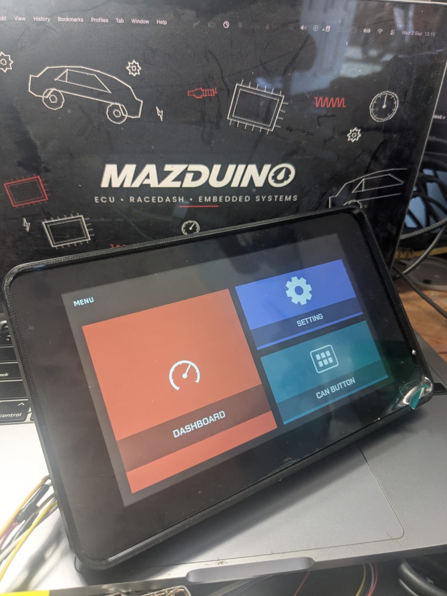

*Menu utama, dibuka dengan cubit dua jari*

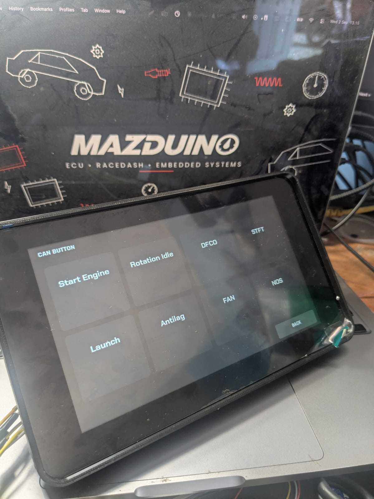

*Halaman tombol CAN, dibuka dengan geser ke atas*

#### Susunan menu

```
Menu
├── Dash      → kembali ke dashboard terakhir
├── CAN       → halaman tombol CAN
└── Setting
    ├── Display Setting   → pilih template, lalu atur isi tiap panelnya
    ├── General Setting   → satuan, RPM maksimum, rentang tiap data
    └── CAN
        ├── Protokol      → pilih tipe ECU
        └── CAN Button    → buat dan ubah tombol CAN
```

#### Display Setting — mengatur isi tiap template

**Menu → Setting → Display Setting**, lalu pilih template yang ingin diubah
(Template 1 sampai Template 5). Setiap kotak data pada template bisa diganti
isinya — misalnya dari tekanan oli menjadi suhu gearbox — dengan
tombol panah kiri/kanan.

Tekan **Save** untuk menyimpan, atau **Discard** untuk membatalkan. Pengaturan
tersimpan di dash dan tidak hilang saat mesin dimatikan.

> **Catatan untuk M7**: **Template 3** pada M7 sudah tetap isinya, jadi
> memilihnya di Display Setting akan langsung membuka tampilannya, bukan
> halaman pengaturan.

#### General Setting — satuan dan rentang data

**Menu → Setting → General Setting**:

- **Satuan tekanan** — kPa atau PSI
- **Satuan suhu** — °C atau °F
- **RPM maksimum** — skala penuh semua gauge RPM, diatur naik-turun 250 RPM;
  garis merah otomatis di sekitar 5/6 dari angka ini
- **Data Source** — daftar semua data source. Pilih salah satu untuk mengatur
  **nilai minimum dan maksimum**-nya, yang menentukan rentang gauge dan angka
  min/max yang tercetak di layar

Perubahan satuan dan RPM maksimum langsung terlihat di semua template.

#### CAN — tipe ECU dan tombol

**Menu → Setting → CAN** berisi dua hal:

- **Protokol** — memilih tipe ECU (rusEFI, Haltech, MaxxECU, Speeduino, OBD-II).
  Kecepatan CAN ikut menyesuaikan sendiri. **Tidak perlu ganti firmware dan
  tidak perlu restart** — begitu disimpan, dash langsung membaca dengan
  protokol yang baru.
- **CAN Button** — membuat dan mengubah tombol CAN: nama, ID, dan data yang
  dikirim. Tombol yang sudah dibuat muncul di halaman tombol CAN.

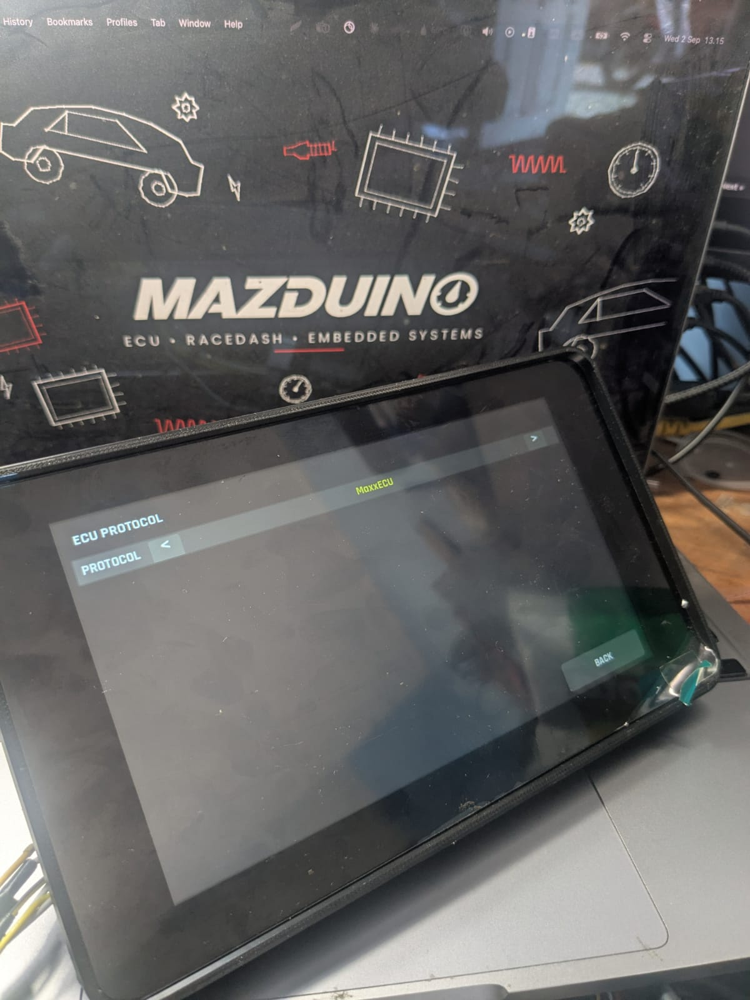

*Menu → Setting → CAN → Protokol*

#### Tombol CAN

Geser ke atas dari dashboard untuk membukanya. Halaman ini dipakai untuk
mengirim perintah ke ECU atau perangkat lain di jaringan CAN — misalnya
menyalakan kipas atau memicu launch control — cukup dengan menekan tombol di
layar. Tombolnya bisa diatur dari layar (Setting → CAN → CAN Button) maupun
dari aplikasi DashTune.

### Pengaturan lain yang hanya ada di DashTune

Beberapa pengaturan tidak tersedia di menu layar dan hanya bisa diubah dari
aplikasi:

- **Mode MAP** — *Absolute* (angka apa adanya, sekitar 101 kPa saat idle) atau
  *Boost* (dihitung dari tekanan udara luar, jadi saat vakum angkanya minus dan
  0 berarti belum ada boost)
- **Lama splash screen** saat dinyalakan
- **Modul GPS** — hanya untuk unit yang memang dipasangi modul GPS

> **Modul GPS bersifat opsional dan tidak termasuk dalam unit yang dijual.**
> Racedash Pro dikirim tanpa modul GPS, sehingga pengaturan ini tidak perlu
> dinyalakan pada unit standar. Modul GPS hanya dipasang atas permintaan khusus
> saat pemesanan. Tanpa modul tersebut, data kecepatan tetap dibaca dari ECU
> seperti biasa.

Pengaturan splash dan GPS baru berlaku setelah dash dimatikan dan dinyalakan
kembali.

### Lampu indikator

Lampu-lampu peringatan menyala otomatis:

| Lampu | Menyala saat |
| :---- | :---- |
| Check engine | ECU melaporkan ada kode kesalahan |
| Aki | Tegangan di luar 11,5–15,5 V |
| Suhu air | Di atas 105 °C |
| Suhu oli | Di atas 130 °C |
| Tekanan oli | Mesin hidup (di atas 800 RPM) tapi tekanan di bawah 100 kPa |
| Sein kiri/kanan, rem tangan, tekanan ban | Hanya pada Haltech |

Semua lampu ikut padam kalau sambungan ke ECU terputus, jadi tidak ada lampu
yang menyala terus setelah kunci kontak dimatikan.

---

## Panduan Aplikasi DashTune

DashTune adalah aplikasi Android untuk mengatur dash dari HP. Untuk Racedash
Pro M4/M5/M7, sambungannya lewat **Bluetooth** — tidak perlu WiFi dan tidak
perlu mencabut apa pun.

> **Mendapatkan aplikasinya:** buka **[www.mazduino.com](https://www.mazduino.com/)**
> dan cari bagian DashTune di halaman depan. Aplikasi ini masih dalam tahap uji
> tertutup, jadi aksesnya diberikan per akun — masukkan alamat email akun Google
> Play Anda di sana, dan undangan akan dikirim lewat email.

### Menyambungkan pertama kali

1. Nyalakan kunci kontak sampai dash menyala.
2. Buka DashTune, masuk ke tab **Perangkat**, tekan **Tambah Dash**.
3. Tekan **Pindai**. Dash akan muncul dengan sendirinya.
4. Pilih dash tersebut. Setelah tersambung, aplikasi langsung membuka halaman
   menu.

Kalau tidak ketemu: pastikan Bluetooth HP menyala, dash dalam keadaan hidup,
dan dash tidak sedang tersambung ke HP lain. Bisa juga memilih modelnya secara
manual di bagian **Model Dash** di layar yang sama.

Dash yang sudah pernah disambungkan akan diingat, dan aplikasi menyambung
sendiri saat dibuka berikutnya.

### Isi menu DashTune

| Menu | Fungsi |
| :---- | :---- |
| **CAN Buttons** | Membuat dan mengatur tombol CAN yang tampil di layar dash |
| **General Setting** | Satuan, mode MAP, RPM maksimum, rentang tiap data — sama dengan menu di layar dash |
| **Dashboard** | Mengatur tata letak panel dan data yang tampil pada tiap template |
| **Splash** | Membuat gambar pembuka sendiri (lihat di bawah) |
| **Info** | Versi firmware dan kondisi perangkat |
| **Update Firmware** | Memperbarui firmware dash |

### Membuat splash screen sendiri

Masuk ke menu **Splash**. Di sana bisa menambahkan gambar dari galeri,
menambah tulisan, menggeser dan memperbesar-kecilkan, lalu memilih warna latar.
Setelah selesai tekan kirim.

Karena gambar dikirim lewat WiFi, dash akan otomatis menyalakan WiFi-nya
sendiri sebentar, HP berpindah ke sana, gambar dikirim, lalu HP kembali ke
jaringan semula. Prosesnya berjalan sendiri — cukup **biarkan layar HP menyala
dan jangan tutup aplikasi** sampai selesai.

Tersedia juga pengaturan **lama tampil** splash, dan tombol untuk menghapusnya
kembali ke gambar bawaan.

### Update firmware

Masuk ke menu **Update Firmware**, aplikasi akan memeriksa versi terbaru dan
menampilkan versi yang terpasang sekarang. Kalau ada versi baru, tekan tombol
update.

> **Peringatan**: Jangan lakukan update sambil berkendara. Selama update layar
> dash akan mati beberapa saat lalu menyala kembali sendiri. Pastikan kendaraan
> dalam keadaan aman, listrik tidak terputus, dan aplikasi tidak ditutup sampai
> selesai. Update yang terputus di tengah jalan bisa membuat dash gagal menyala.

### Fitur relay: Google Maps dan musik

DashTune bisa meneruskan **petunjuk arah Google Maps** dan **judul lagu yang
sedang diputar** ke layar dash. Pengaturannya ada di tab **Lainnya → Relay**.

Fitur ini perlu izin akses notifikasi di HP, dan aplikasi akan mengarahkan ke
halaman pengaturannya saat pertama kali diaktifkan.

## Pengaturan via Touchscreen (firmware lama)

> **Bagian ini untuk firmware generasi lama.** Kalau dash-mu bisa **digeser
> kiri-kanan untuk berganti tampilan**, berarti memakai firmware M4/M5/M7 dan
> menunya berbeda — lihat
> [Menu di layar (M4 / M5 / M7)](#menu-di-layar-m4-m5-m7).

Pada firmware lama, semua pengaturan tersedia langsung melalui menu di layar (swipe/tap antar halaman) tanpa perlu WiFi/browser. Menu pengaturan terdiri dari 6 halaman berikut:

- [Main Screen](#main-screen)
- [Bench Test Screen (Khusus rusEFI)](#bench-test-screen-khusus-rusefi)
- [Warning Setting Screen](#warning-setting-screen)
- [Slot Setting Screen](#slot-setting-screen)
- [Display Setting Screen](#display-setting-screen)
- [Connection Setting Screen](#connection-setting-screen)

### Main Screen

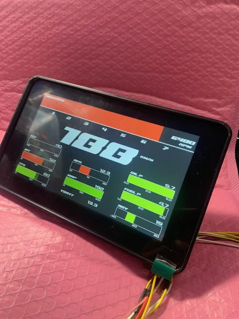

Halaman utama menampilkan data real-time dari ECU:

- **Gear indicator & shift light bar** di bagian atas (angka gigi 1–7, warna bar berubah mengikuti RPM) beserta nilai RPM di pojok kanan atas
- **Kecepatan (KM/H)** ditampilkan besar di tengah layar
- **6 slot data** tambahan (kiri dan kanan) berupa gauge bar + nilai, misalnya Oil Pressure (OIL P), Fuel Pressure (FUEL P), VBATT, MAP, dan Ignition Advance (ADV) — parameter pada tiap slot dapat diatur melalui [Slot Setting Screen](#slot-setting-screen)

### Bench Test Screen (Khusus rusEFI)

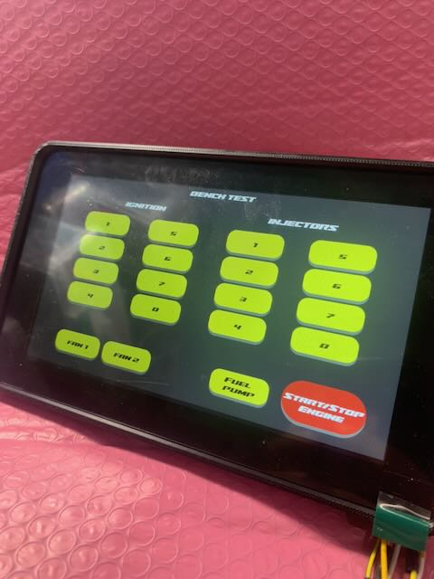

Halaman khusus untuk ECU **rusEFI** yang digunakan untuk menguji wiring/actuator sebelum mesin dinyalakan, tanpa perlu bantuan software tambahan di laptop. Tersedia tombol untuk memicu langsung:

- **Ignition** koil pengapian 1–8
- **Injectors** injektor 1–8
- **Fan 1** dan **Fan 2**
- **Fuel Pump**
- **Start/Stop Engine**

### Warning Setting Screen

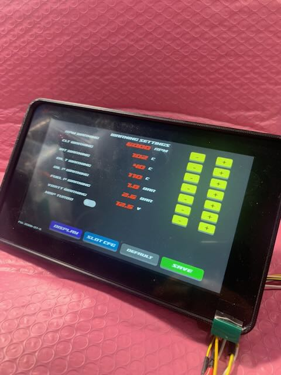

Halaman untuk mengatur batas (threshold) peringatan pada tiap parameter, masing-masing dengan tombol **+ / -** untuk mengubah nilai:

- **RPM Warning** — batas RPM/shift light
- **CLT Warning** — batas suhu air (Coolant Temp)
- **IAT Warning** — batas suhu udara masuk (Intake Air Temp)
- **Oil P Warning** — batas tekanan oli
- **Fuel P Warning** — batas tekanan bahan bakar
- **VBATT Warning** — batas tegangan baterai

Terdapat juga tombol navigasi ke **Display** dan **Slot Cfg**, tombol **Default** untuk mengembalikan ke pengaturan awal, serta tombol **Save** untuk menyimpan perubahan.

### Slot Setting Screen

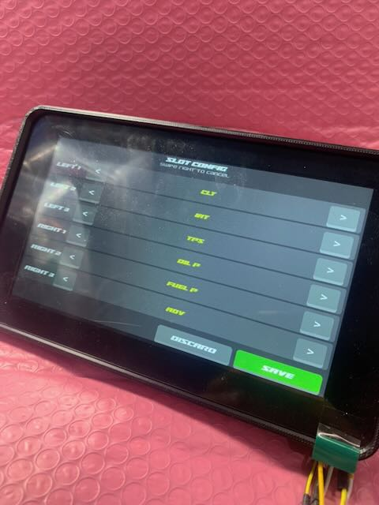

Halaman **Slot Config** untuk mengatur parameter yang ditampilkan pada tiap slot di Main Screen. Slot tersedia untuk posisi **Left 1–3** dan **Right 1–3**, masing-masing dapat dipilih dari daftar parameter yang tersedia (contoh: CLT, BAT, TPS, OIL P, FUEL P, ADV) dengan cara swipe. Gunakan tombol **Discard** untuk membatalkan perubahan atau **Save** untuk menyimpan.

### Display Setting Screen

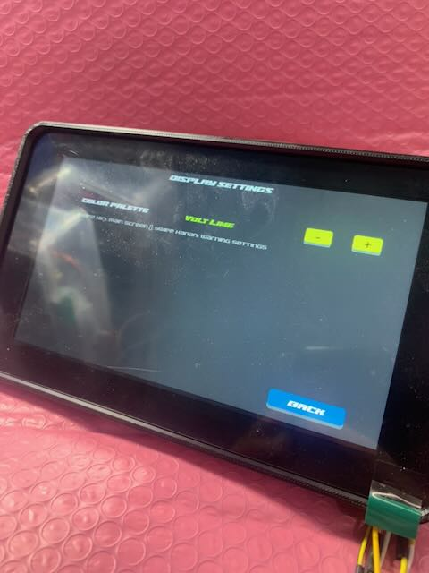

Halaman **Display Settings** untuk mengatur tampilan dashboard:

- **Color Palette** — pilihan tema/skema warna tampilan (contoh: "Volt Line"), diatur dengan tombol **+ / -**

Tombol **Back** digunakan untuk kembali ke halaman sebelumnya.

### Connection Setting Screen

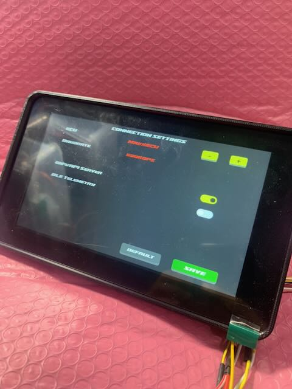

Halaman **Connection Settings** untuk mengatur mode komunikasi ke ECU:

- **ECU** — pilih tipe ECU yang digunakan (rusEFI, Haltech, MaxxECU, atau Speeduino), diatur dengan tombol **+ / -**
- **Baudrate** — baudrate komunikasi CAN Bus mengikuti ECU yang dipilih secara otomatis: **1 Mbps** untuk **Haltech**, dan **500 kbps** untuk ECU lainnya
- **WiFi/AP Server** — tombol on/off untuk mengaktifkan/menonaktifkan WiFi Access Point pada Racedash Pro
- **BLE Telemetry** — tombol on/off untuk mengaktifkan/menonaktifkan pengiriman data telemetri via Bluetooth Low Energy

Tombol **Default** mengembalikan ke pengaturan awal, dan **Save** menyimpan perubahan.

## Referensi

- Website Mazduino - [https://www.mazduino.com/](https://www.mazduino.com/)
- Wiki Mazduino - [https://wiki.mazduino.com/](https://wiki.mazduino.com/)
- Github Mazduino - [https://github.com/mazduino/mazduino](https://github.com/mazduino/mazduino)
