# Mazduino Racedash

## Gambaran Umum

Mazduino Racedash adalah dash display digital yang menampilkan data real-time dari ECU, seperti RPM, gear indicator, kecepatan, dan berbagai data sensor lainnya. Halaman ini membahas varian layar **3.5"** dan **4"**. Untuk varian layar lebih besar (4.3", 5", dan 7"), lihat **[Mazduino Racedash Pro](mazduino-racedash-pro.md)**.

| Varian | Ukuran Layar | Konektor |
| :---- | :---- | :---- |
| [Racedash 3.5"](#racedash-35-konektor-jst-4-pin) | 3.5 inch | JST 4 Pin |
| [Racedash 4" (Cabus)](#racedash-4-cabus-konektor-dtm4) | 4 inch | DTM4 (Deutsch DTM 4 Pin) |

Kedua varian menggunakan cara konfigurasi yang sama melalui WiFi dan browser, seperti dijelaskan pada bagian [Konfigurasi](#konfigurasi) di bawah.

## Fitur Utama

- Layar digital menampilkan RPM, gear indicator, kecepatan, dan data sensor lain secara real-time
- Konfigurasi tampilan dashboard via WiFi langsung dari browser HP/laptop, tanpa aplikasi tambahan
- Mendukung komunikasi ke ECU melalui **CAN Bus** atau **Serial**, tergantung permintaan saat order dan ECU yang digunakan. ECU berbasis **Speeduino** wajib menggunakan mode Serial (berlaku untuk varian JST 4 Pin maupun DTM4), sedangkan **rusEFI**, **Haltech**, dan **MaxxECU** menggunakan mode CAN Bus

## Custom Splash Screen

Racedash mendukung splash screen (gambar/logo) custom yang tampil saat perangkat baru menyala. Splash screen dibuat melalui **Splash Screen Generator** dan diunggah ke Racedash melalui WiFi.

1. Buka **[mazduino.com/splash-generator](https://www.mazduino.com/splash-generator)** melalui browser HP/laptop.
2. Buat splash screen sesuai keinginan mengikuti instruksi pada halaman tersebut.
3. Unggah hasilnya ke Racedash melalui koneksi WiFi **"Mazduino_Display"**.

## Racedash 3.5" (Konektor JST 4 Pin)

Varian ini menggunakan konektor **JST 4 Pin** yang ringkas untuk instalasi cepat. Tidak ada port USB yang terekspos di luar case — update firmware dilakukan secara **OTA (Over-The-Air)** melalui WiFi, lihat bagian [Update Firmware](#update-firmware-usb-atau-ota).

### Konektor JST 4 Pin (Wiring ke Kendaraan)

Konektor eksternal yang digunakan untuk menghubungkan Racedash ke kendaraan/ECU.

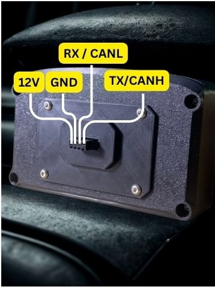

| Pin | Fungsi |
| :---- | :---- |
| 1 | 12V |
| 2 | GND |
| 3 | RX / CANL |
| 4 | TX / CANH |

### Pin Header Internal PCB

Selain konektor JST 4 Pin, board Racedash 3.5" juga memiliki pin header internal dengan fungsi tambahan untuk mode Serial dan update firmware via USB TTL.

| Pin | Deskripsi |
| :---- | :---- |
| +12V | Power Supply 12V |
| GND | Ground |
| CANL | (CAN Mode) Hubungkan ke CANL ECU |
| CANH | (CAN Mode) Hubungkan ke CANH ECU |
| RX2 | (Serial Mode) Hubungkan ke TX Serial3 Speeduino ECU |
| TX2 | (Serial Mode) Hubungkan ke RX Serial3 Speeduino ECU |
| TXD0 | Hubungkan ke USB TTL RX (Optional) |
| RXD0 | Hubungkan ke USB TTL TX (Optional) |

**Catatan:**

- CANL dan CANH digunakan saat **CAN Mode**, sedangkan RX2 dan TX2 digunakan saat **Serial Mode**. Mode yang terpasang mengikuti permintaan saat order — ECU **Speeduino** menggunakan Serial Mode, sedangkan **rusEFI**, **Haltech**, dan **MaxxECU** menggunakan CAN Mode.
- +12V dan GND adalah jalur power utama.
- TXD0 dan RXD0 terhubung ke chip USB-TTL internal (**CP2102N**) pada PCB, namun pin ini **tidak terekspos ke luar case** dan hanya digunakan untuk servis/flashing di pabrik. Untuk update firmware oleh pengguna, gunakan metode OTA melalui Mazduino Flasher — lihat bagian [Update Firmware](#update-firmware-usb-atau-ota).

## Racedash 4" / Cabus (Konektor DTM4)

**Tampak Depan**

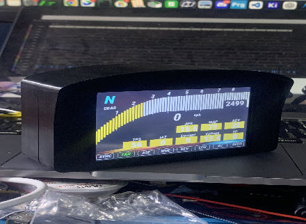

**Tampak Belakang**

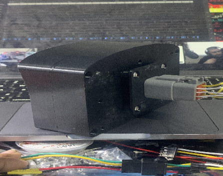

Varian ini menggunakan konektor **DTM4 (Deutsch DTM 4 Pin)** yang tahan getaran dan cuaca, cocok untuk aplikasi racing. Komunikasi ke ECU dilakukan melalui **CAN Bus**, kecuali untuk ECU **Speeduino** yang menggunakan mode **Serial** (secondary serial dari Arduino Mega).

### Konektor DTM4 / 4 Pin

*Dash connector side*

*Cable connector side*

| No. Pin | Deskripsi |
| :---- | :---- |
| 1 | 12V Power Supply |
| 2 | Ground |
| 3 | CAN High / TX |
| 4 | CAN Low / RX |

**Catatan:**

- Pin 3 dan 4 berfungsi sebagai **CAN High/CAN Low** untuk ECU **rusEFI**, **Haltech**, dan **MaxxECU** (mode CAN Bus).
- Khusus untuk ECU **Speeduino**, pin 3 dan 4 berfungsi sebagai **TX/RX Serial** — Speeduino tidak memiliki CAN Bus native, sehingga data diambil melalui **secondary serial (Serial3) Arduino Mega**.

## Update Firmware (USB atau OTA)

Update firmware Racedash dapat dilakukan dengan dua cara:

1. **USB** — membuka case Racedash, lalu menghubungkan port/pin USB TTL internal ke komputer secara langsung.
2. **OTA (Over-The-Air)** — melalui WiFi menggunakan **Mazduino Flasher**, tanpa perlu membuka case.

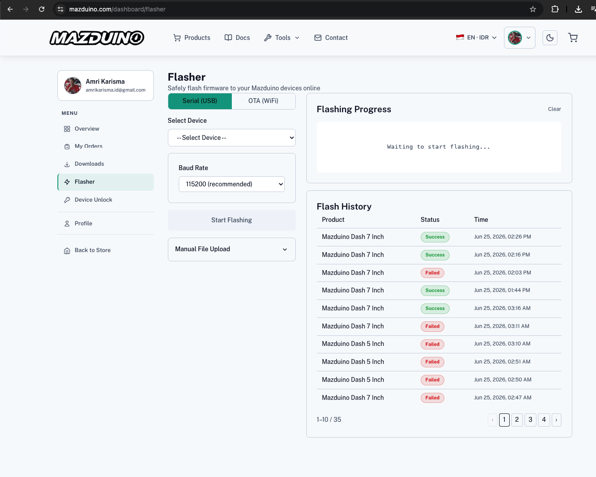

1. Login terlebih dahulu ke akun Mazduino di [mazduino.com](https://www.mazduino.com/), lalu buka **[mazduino.com/dashboard/flasher](https://www.mazduino.com/dashboard/flasher)**.
2. Pilih tab **OTA (WiFi)**.
3. Hubungkan HP/laptop ke WiFi **"Mazduino_Display"** yang dipancarkan oleh Racedash, atau pastikan Racedash berada di jaringan WiFi yang sama.
4. Pilih model Racedash yang sesuai pada **Select Device** — **pastikan device dipilih dengan benar** — lalu klik **Start Flashing**.
5. Tunggu proses flashing selesai. Riwayat proses dapat dilihat pada **Flash History**.

## Konfigurasi

Pada firmware terbaru ada dua cara mengatur tampilan dashboard: lewat **browser** di
mazduino.com, atau lewat aplikasi Android **DashTune**. Keduanya mengatur hal yang sama
dan berlaku untuk kedua varian Racedash — pilih mana yang lebih praktis.

Halaman konfigurasi lokal `192.168.4.1` hanya dipakai oleh firmware lama, dan ada di
bagian paling bawah halaman ini.

### Lewat Browser (mazduino.com)

1. Sebelum berpindah WiFi, buka browser dan akses **[https://www.mazduino.com/display-control](https://www.mazduino.com/display-control)** terlebih dahulu selagi HP/laptop masih terhubung internet.
2. Setelah halaman terbuka, hubungkan WiFi HP/laptop ke **"Mazduino_Display"** dengan password **"12345678"** yang dipancarkan oleh Racedash. Koneksi internet akan terputus, namun halaman yang sudah terbuka tetap dapat digunakan.
3. Tunggu hingga Racedash terdeteksi otomatis pada **Network Scanner**. Jika tidak terdeteksi otomatis, masukkan IP Racedash secara manual pada kolom **Manual IP Address**: **192.168.4.1**, lalu klik **Test Connection**.

   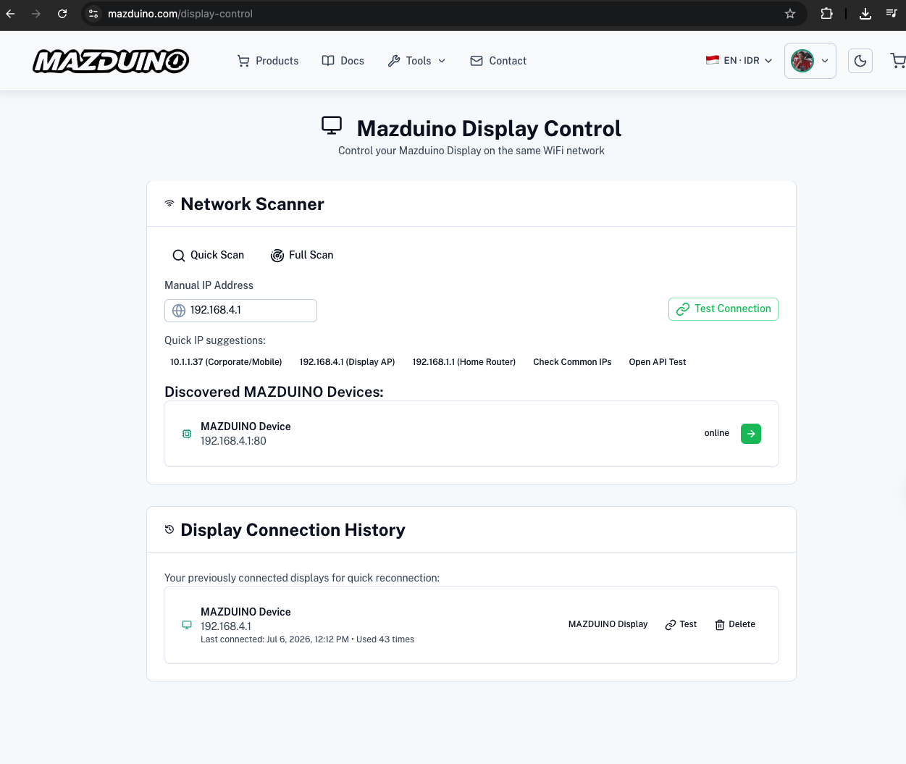

4. Setelah terhubung, halaman **Display Control** menampilkan informasi device serta data CAN Bus/ECU secara real-time.

   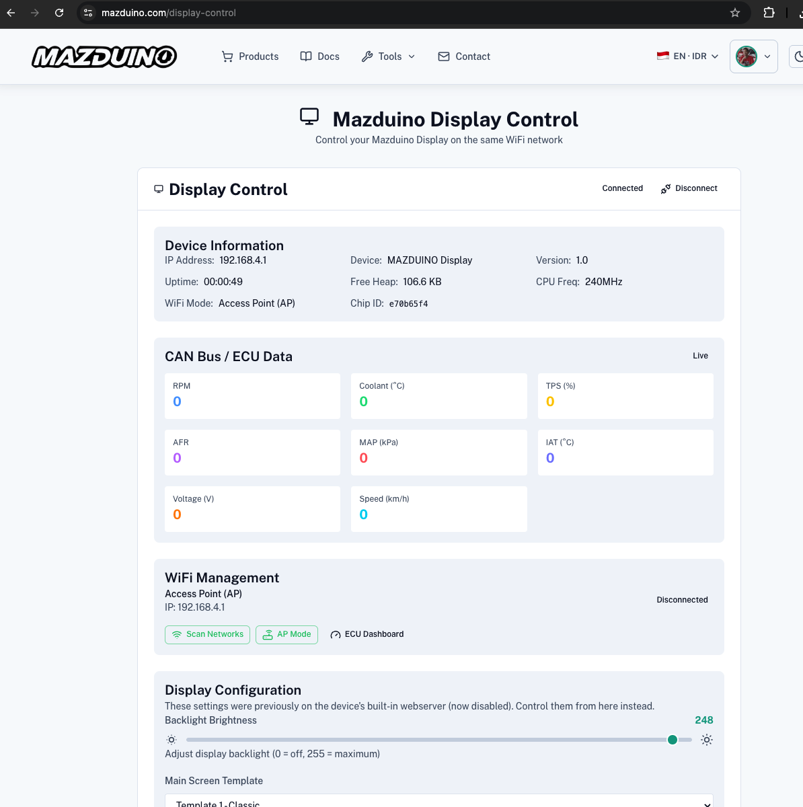

5. Atur data yang ditampilkan pada tiap posisi panel, template layar, brightness, dan mode komunikasi (CAN Bus/Serial) sesuai kebutuhan pada bagian **Display Configuration**.

   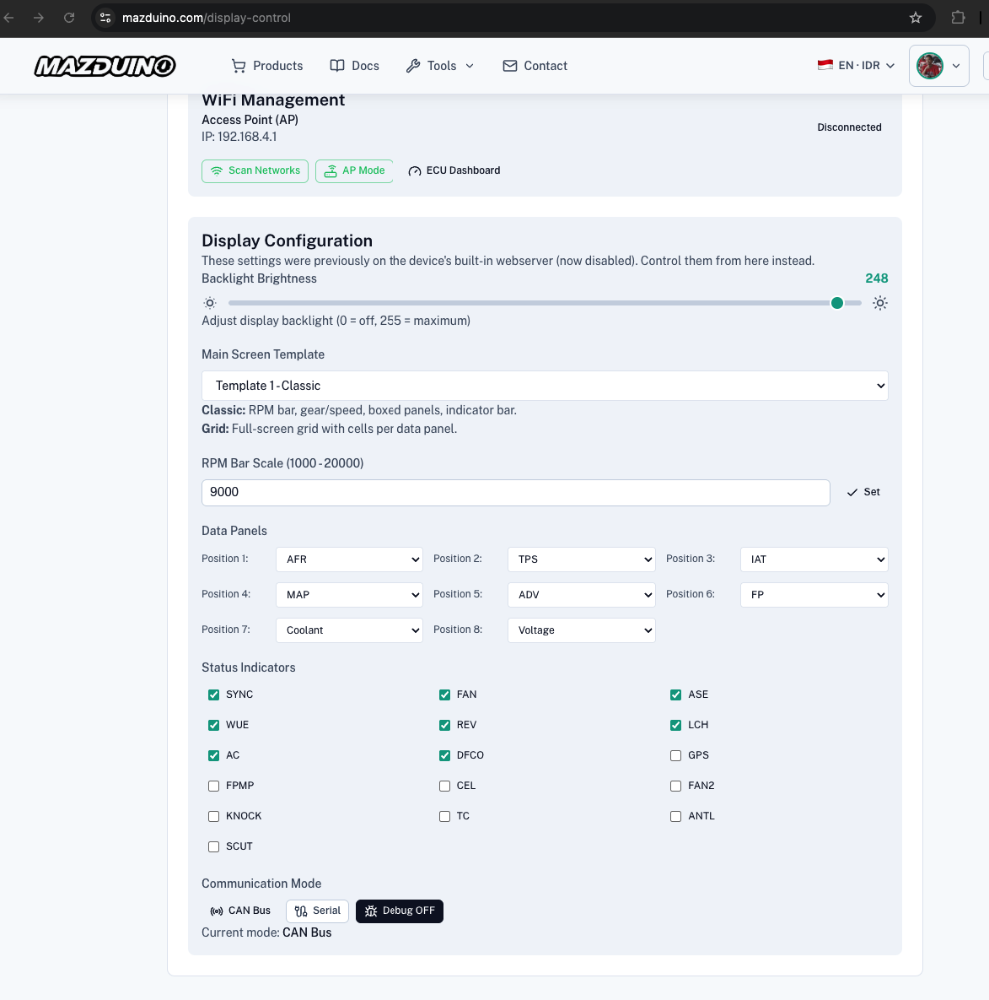

### Lewat Aplikasi DashTune (Android)

DashTune dapat mengatur Racedash lewat WiFi, tanpa membuka browser. Racedash
M1/M2/M3/C1 tersambung lewat **WiFi** (berbeda dengan Racedash Pro M4/M5/M7
yang lewat Bluetooth).

1. Pasang DashTune di HP Android, lalu hubungkan WiFi HP ke **"Mazduino_Display"**
   dengan password **"12345678"**.
2. Buka DashTune. Dash akan terdeteksi sendiri dan muncul sebagai kartu di
   halaman **Home**.
3. Pilih **Display Control** untuk mengatur brightness, template layar, RPM
   maksimum, data tiap panel, serta indikator mana saja yang ditampilkan.
4. Menu **Splash** dan **Background** dipakai untuk mengganti gambar pembuka dan
   latar template.

Pengaturan lampu RPM (RGB) hanya muncul pada dash yang memang memiliki strip
LED-nya, sehingga menu ini tidak akan tampil di unit tanpa LED.

<strong>Firmware lama / legacy — konfigurasi lewat 192.168.4.1</strong> (klik untuk membuka)

Bagian ini hanya berlaku untuk firmware versi lama, yang masih memakai halaman
konfigurasi lokal di `192.168.4.1`. Kalau Racedash Anda sudah menjalankan
firmware terbaru, pakai salah satu cara di atas dan lewati bagian ini.

1. Hubungkan HP/laptop ke WiFi **"Mazduino_Display"** dengan password **"12345678"**.

   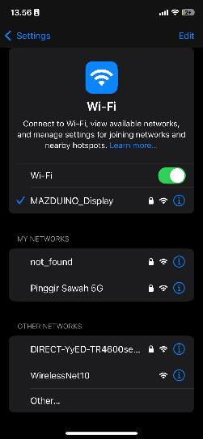

2. Setelah terhubung, buka browser dan akses [http://192.168.4.1](http://192.168.4.1).

   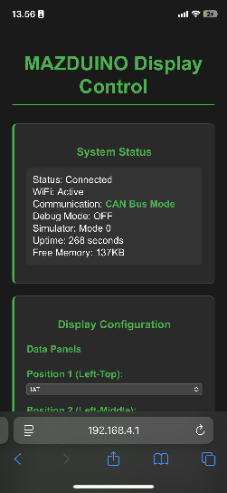

3. Atur data yang ditampilkan pada tiap posisi panel sesuai kebutuhan.

   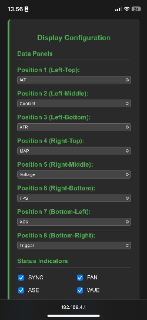

   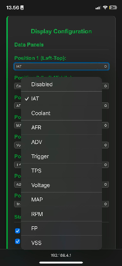

Untuk varian layar lebih besar (4.3", 5", dan 7"), lihat **[Mazduino Racedash Pro](mazduino-racedash-pro.md)**.

## Referensi

- Website Mazduino - [https://www.mazduino.com/](https://www.mazduino.com/)
- Wiki Mazduino - [https://wiki.mazduino.com/](https://wiki.mazduino.com/)
- Github Mazduino - [https://github.com/mazduino/mazduino](https://github.com/mazduino/mazduino)

Jika butuh skematik dan file pendukung lainnya, tersedia di website Mazduino.
