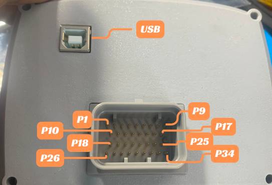

# Mazduino X600

## Gambaran Umum

Mazduino X600 adalah ECU dengan **layar terintegrasi 4.3 inch** — unit **Dash dan ECU menjadi satu**, sehingga tidak memerlukan dash display terpisah untuk memantau data mesin secara real-time. Produk ini berbasis firmware **rusEFI** dan dikonfigurasi/tuning melalui software **TunerStudio**.

Koneksi ke komputer menggunakan **USB Type B**, sedangkan wiring ke harness mesin menggunakan **konektor 34-pin**. Dengan 6 output ignition, 12 output low side, kombinasi input Hall (Digital) dan VR, serta input analog untuk sensor tegangan dan temperatur, X600 mendukung mesin hingga **6 silinder**.

Dokumentasi ini disusun berdasarkan spesifikasi produk Mazduino X600 dan referensi pinout hardware pada dokumen manual X600.

## Fitur Utama

- **Layar 4.3 inch terintegrasi** — Dash dan ECU dalam satu unit untuk menampilkan RPM, data sensor, dan status mesin secara real-time (display-only; seluruh tuning dilakukan via TunerStudio)
- Firmware **rusEFI based**
- Koneksi ke komputer via **USB Type B** untuk tuning dengan **TunerStudio**
- **Konektor 34-pin** untuk wiring ke harness mesin
- **6x output ignition** (IGN1–IGN6; IGN5/IGN6 berbagi jalur dengan High Side 1/2)
- **2x output High Side** (HS1, HS2) untuk beban 12V switching (via jumper option pada IGN5/IGN6)
- **12x output low side** (LS1–LS12) untuk injektor, idle PWM, boost, VVT, relay, dan aktuator lain
- **4x input Analog Volt** (AV1–AV4) untuk MAP, TPS, O2/wideband, PPS, atau sensor tekanan (0–5V)
- **4x input Analog Temp** (AT1, AT2, AT3, AT6) untuk CLT, IAT, dan sensor temperatur lain
- **2x input Digital/Hall** (Digital 1, Digital 2) untuk CKP/CMP, VSS, atau switch
- **2x input VR** (VR1, VR2) untuk CKP/CMP tipe variable reluctor (berbagi jalur dengan Digital/Analog Temp via **jumper option**)
- **Output TACH** untuk sinyal RPM ke tacho
- Built-in **5V sensor supply** untuk referensi sensor 5V

## Wiring dan Instalasi

X600 menggunakan **konektor 34-pin** untuk seluruh koneksi ke harness mesin, dan **USB Type B** terpisah untuk koneksi tuning ke komputer.



*Posisi pin pada konektor 34-pin dan port USB Type B.*

### Layout Konektor 34-pin

```
P1   P2   P3   P4   P5   P6   P7   P8   P9
P10  P11  P12  P13  P14  P15  P16  P17
P18  P19  P20  P21  P22  P23  P24  P25
P26  P27  P28  P29  P30  P31  P32  P33  P34
```

### Pin Assignment Konektor 34-pin

| Pin | Fungsi | Keterangan |
|-----|--------|------------|
| P1 | 12V | 12V ECU power supply |
| P2 | IGN6 / HS2 | Ignition 6 atau High Side 2 (12V switching) — jumper option |
| P3 | IGN5 / HS1 | Ignition 5 atau High Side 1 (12V switching) — jumper option |
| P4 | IGN2 | Ignition 2 |
| P5 | TACH | Output sinyal tacho (RPM) |
| P6 | AT6 / VR1- | Analog Temp 6 atau VR1- (input VR1 negatif) — jumper option |
| P7 | AT3 / VR2- | Analog Temp 3 atau VR2- (input VR2 negatif) — jumper option |
| P8 | AT2 | Analog Temp 2 |
| P9 | AT1 | Analog Temp 1 |
| P10 | GND | Power ground (ECU power ground) |
| P11 | IGN4 | Ignition 4 |
| P12 | IGN3 | Ignition 3 |
| P13 | IGN1 | Ignition 1 |
| P14 | AV1 | Analog Volt 1 (input 0–5V) |
| P15 | AV2 | Analog Volt 2 (input 0–5V) |
| P16 | AV3 | Analog Volt 3 (input 0–5V) |
| P17 | AV4 | Analog Volt 4 (input 0–5V) |
| P18 | LS2 | Low Side 2 |
| P19 | LS1 | Low Side 1 |
| P20 | DIGITAL1 / VR1+ | Digital 1 (Hall) atau VR1+ (input VR1 positif) — jumper option |
| P21 | DIGITAL2 / VR2+ | Digital 2 (Hall) atau VR2+ (input VR2 positif) — jumper option |
| P22 | GND | Sensor ground |
| P23 | GND | Sensor ground |
| P24 | 5V SENSOR | 5V sensor supply |
| P25 | LS12 | Low Side 12 |
| P26 | LS4 | Low Side 4 |
| P27 | LS3 | Low Side 3 |
| P28 | LS6 | Low Side 6 |
| P29 | LS5 | Low Side 5 |
| P30 | LS8 | Low Side 8 |
| P31 | LS7 | Low Side 7 |
| P32 | LS9 | Low Side 9 |
| P33 | LS10 | Low Side 10 |
| P34 | LS11 | Low Side 11 |

### Jalur Bersama (Jumper Option)

Beberapa pin memiliki fungsi ganda yang dipilih melalui **jumper**. Konfigurasi jumper dapat **ditentukan saat pemesanan pertama** (dipilih sesuai kebutuhan mesin) atau **diubah sendiri** dengan mengatur jumper pada board. Selalu matikan sumber daya ECU sebelum mengubah konfigurasi jumper.

- **P2 (IGN6 / HS2)** dan **P3 (IGN5 / HS1)** — dapat dikonfigurasi sebagai output **ignition** (IGN5/IGN6) atau sebagai **High Side** (HS1/HS2) untuk beban 12V switching, misalnya alternator control atau solenoid 12V.
- **P6 (AT6 / VR1-)** dan **P20 (DIGITAL1 / VR1+)** — pasangan jalur untuk **VR1**. Pilih sebagai VR (VR1+ dan VR1-) untuk sensor CKP/CMP tipe variable reluctor, atau sebagai Analog Temp 6 + Digital 1 (Hall) untuk sensor Hall/temperatur.
- **P7 (AT3 / VR2-)** dan **P21 (DIGITAL2 / VR2+)** — pasangan jalur untuk **VR2**, dengan pola konfigurasi yang sama seperti VR1.

> **Catatan:** Fungsi pin di atas ditentukan oleh posisi jumper. Pastikan konfigurasi jumper sesuai dengan wiring dan jenis sensor/aktuator yang dipakai. Jika ragu, tentukan konfigurasi saat pemesanan.

## Ringkasan Jumlah I/O

| Kelompok | Jumlah | Keterangan |
|----------|--------|------------|
| Ignition Output | 6 | IGN1–IGN6 (IGN5/IGN6 berbagi jalur dengan HS1/HS2) |
| High Side | 2 | HS1, HS2 untuk 12V switching (via jalur IGN5/IGN6) |
| Low Side | 12 | LS1–LS12 untuk injektor dan aktuator |
| Input Analog Volt | 4 | AV1–AV4 (0–5V) |
| Input Analog Temp | 4 | AT1, AT2, AT3, AT6 |
| Input Digital/Hall | 2 | Digital 1, Digital 2 (berbagi jalur dengan VR+) |
| Input VR | 2 | VR1 (+/-), VR2 (+/-) |
| Output Tacho | 1 | TACH |
| 5V Sensor Supply | 1 | Referensi 5V sensor |

## Mapping Fungsional Firmware

Berikut mapping fungsi umum untuk setup firmware. Assignment dapat disesuaikan dengan kebutuhan mesin dan strategi tuning.

| Fungsi Umum | Jalur Default |
|------------|---------------|
| Ignition 1–6 | IGN1 sampai IGN6 |
| Injector | Low Side (LS1 dan seterusnya) |
| Main Relay / Fuel Pump / Fan / AC / Idle | Low Side (LS yang tidak dipakai injector) |
| MAP / TPS / O2 / PPS / Sensor tekanan | Analog Volt 1–4 |
| CLT / IAT / Temp tambahan | Analog Temp (AT1, AT2, AT3, AT6) |
| CKP / CMP Hall | Digital 1 dan Digital 2 |
| CKP / CMP VR | VR1 dan VR2 (via jalur bersama) |
| Tacho | TACH |

## Contoh Skenario Penggunaan I/O

Jalur Low Side, Analog Volt, dan Analog Temp bersifat generik sehingga alokasinya tergantung konfigurasi mesin. Beberapa contoh skenario:

- **Mesin 6 silinder full sequential**: gunakan IGN1–IGN6 untuk ignition COP/individual, dan 6 jalur Low Side untuk injektor sequential. Sisa Low Side (LS7–LS12) bebas dipakai untuk idle PWM, boost solenoid, VVT, fuel pump, fan, atau aktuator lain.
- **Mesin 4 silinder**: gunakan 4 channel ignition dan 4 Low Side untuk injektor, sisanya untuk aktuator dan relay. Jalur IGN5/IGN6 dapat dialihkan menjadi High Side (HS1/HS2) untuk 12V switching.
- **Trigger VR**: untuk sensor CKP/CMP tipe variable reluctor, gunakan jalur VR1 (P6 + P20) dan VR2 (P7 + P21).
- **Trigger Hall**: untuk sensor CKP/CMP tipe Hall, gunakan Digital 1 (P20) dan Digital 2 (P21).
- **Analog Volt**: input sensor analog 0–5V seperti MAP, TPS, O2/wideband, PPS, atau sensor tekanan.
- **Analog Temp**: input sensor temperatur seperti CLT (Coolant Temp) dan IAT (Intake Air Temp).

## Layar Terintegrasi 4.3 inch

X600 dilengkapi layar **4.3 inch** yang menyatu dengan ECU untuk menampilkan data mesin secara real-time (RPM, data sensor, dan status), sehingga tidak memerlukan dash display terpisah. Layar bersifat **display-only** — seluruh konfigurasi dan tuning dilakukan melalui **TunerStudio**, bukan melalui menu di layar.

## Software Tuning

X600 dikonfigurasi dan dituning menggunakan **TunerStudio** melalui koneksi **USB Type B** ke komputer.

1. Hubungkan X600 ke komputer menggunakan kabel **USB Type B**.
2. Buka **TunerStudio** dan pilih/port yang sesuai, lalu hubungkan ke ECU.
3. Gunakan file konfigurasi (firmware/definition) yang memang ditujukan untuk **Mazduino X600** agar seluruh pin berfungsi sesuai desain board.
4. Lakukan pengecekan output dengan test mode di TunerStudio sebelum start engine.

## Panduan Instalasi Singkat

1. Pastikan **power ground** (P10) dan **sensor ground** (P22, P23) terhubung dengan baik.
2. Hubungkan P1 ke suplai 12V ECU yang stabil.
3. Pilih mode trigger **Hall (Digital)** atau **VR** sesuai jenis sensor CKP/CMP, lalu wiring pada jalur bersama yang sesuai.
4. Tentukan pemakaian jalur IGN5/IGN6 sebagai ignition atau High Side sesuai kebutuhan.
5. Hubungkan sensor 5V ke jalur 5V Sensor Supply (P24) dan sensor temperatur/tegangan ke jalur Analog yang sesuai.
6. Hubungkan X600 ke komputer via USB Type B dan verifikasi output dengan test mode di TunerStudio sebelum menyalakan mesin.

## Catatan Penting

- Layar 4.3 inch bersifat **display-only**; seluruh tuning dilakukan via TunerStudio.
- Output ignition ditujukan untuk **smart coil**. Untuk dumb coil wajib menggunakan driver/IGBT eksternal.
- **HS1 dan HS2** (jalur IGN5/IGN6) dapat digunakan sebagai output **12V switching**, misalnya alternator control.
- Jalur VR (VR1/VR2) berbagi pin dengan Digital dan Analog Temp — pastikan hanya satu fungsi yang diwiring per pasangan pin.
- Firmware untuk board ini berbasis **rusEFI**. Gunakan definition/firmware khusus X600.

## Referensi

- Website Mazduino - [https://www.mazduino.com/](https://www.mazduino.com/)
- Wiki Mazduino - [https://wiki.mazduino.com/](https://wiki.mazduino.com/)
- Download TunerStudio - [https://www.tunerstudio.com/index.php/downloads](https://www.tunerstudio.com/index.php/downloads)
- Referensi firmware rusEFI - [https://wiki.rusefi.com](https://wiki.rusefi.com)
