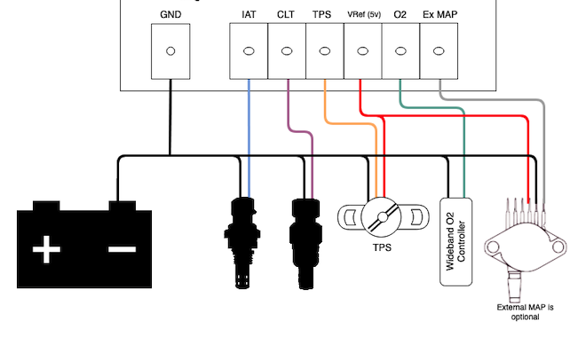
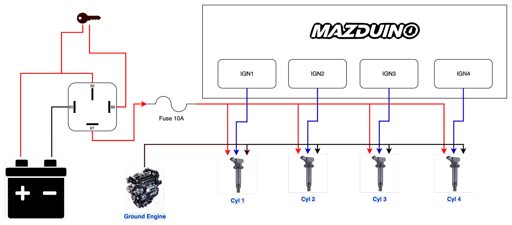
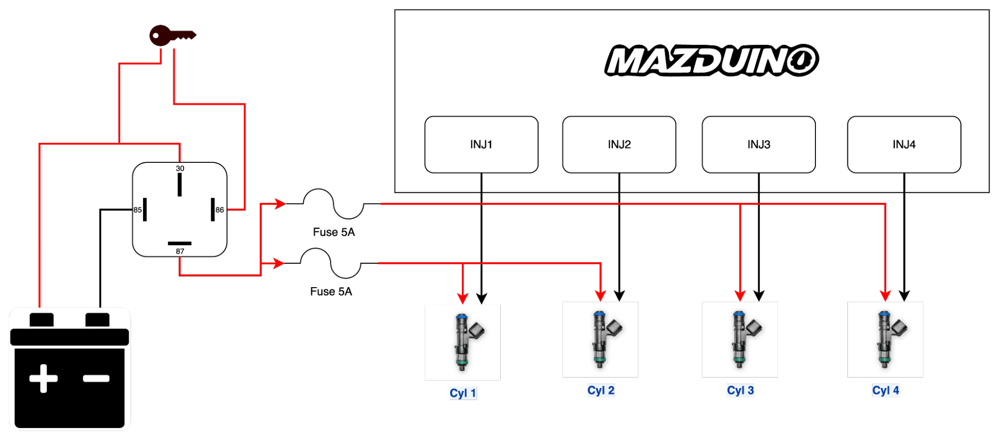

# Persiapan Sensor dan Wiring

## Pengantar

Sebelum masuk ke konfigurasi TunerStudio, ECU perlu dipasang dengan sensor yang lengkap dan wiring yang benar. Kesalahan wiring adalah penyebab paling umum mesin tidak mau start atau tuning yang tidak stabil, jadi tahap persiapan ini sebaiknya tidak dilewati.

Halaman ini membahas sensor dasar yang dibutuhkan untuk kebanyakan aplikasi standalone ECU, prinsip wiring yang benar, dan contoh skema untuk mesin 4 silinder. Pin exact untuk masing-masing board (Compact 4CH, Mini 6CH, Core, LITE) dapat dilihat di halaman dokumentasi hardware masing-masing produk.

## Sensor Dasar yang Dibutuhkan

| Sensor | Fungsi | Wajib? | Jenis Sinyal | Catatan |
|--------|--------|--------|--------------|---------|
| CKP (Crankshaft Position) | Referensi RPM dan sinkronisasi mesin | **Wajib** | Hall (3-wire) atau VR (2-wire) | Tanpa sensor ini mesin tidak akan menyala |
| CMP (Camshaft Position) | Sinkronisasi bank/silinder untuk sequential injection & ignition | Wajib untuk sequential, opsional untuk wasted spark/batch | Hall (3-wire) atau VR (2-wire) | Bisa lebih dari 1 tergantung mesin (mis. dual VVT) |
| TPS (Throttle Position) | Posisi throttle untuk acceleration enrichment dan idle | **Wajib** | Analog 0-5V (potensiometer 3-wire) | Kalibrasi 0% dan 100% wajib dilakukan di TunerStudio |
| MAP (Manifold Absolute Pressure) | Load mesin untuk strategi Speed Density | Wajib untuk Speed Density, opsional untuk Alpha-N | Analog 0-5V | Bisa built-in di board atau eksternal tergantung produk |
| CLT (Coolant Temperature) | Suhu coolant untuk fueling & kontrol kipas | **Wajib** | Analog (NTC thermistor 2-wire) | Gunakan sensor sesuai tabel resistansi yang didukung firmware |
| IAT (Intake Air Temperature) | Suhu udara masuk untuk koreksi densitas udara | **Wajib** | Analog (NTC thermistor 2-wire) | Pasang sedekat mungkin dengan intake, hindari panas radiator |
| Battery Voltage | Referensi tegangan untuk koreksi dwell/duty cycle | Otomatis (built-in) | Analog internal | Tidak perlu wiring tambahan, dibaca dari suplai 12V ECU |
| O2 / Wideband | Feedback AFR untuk closed loop dan tuning | Sangat disarankan | Analog 0-5V (linear wideband controller) | Wajib untuk tuning fuel yang akurat |

Contoh wiring dasar untuk sensor analog — ground sensor, IAT, CLT, TPS, referensi 5V (VRef), O2, dan MAP eksternal (opsional) — semuanya diambil langsung dari konektor ECU:

## Prinsip Wiring yang Benar

### Grounding

- **Ground ECU** sebaiknya diambil **langsung dari terminal negatif aki, atau sedekat mungkin dengan aki** — jangan digroundkan ke body. Body/chassis memiliki resistansi dan drop tegangan yang lebih besar dan tidak konsisten, yang dapat menyebabkan noise dan ground offset pada pembacaan sensor.
- **Ground coil pengapian wajib dipisah** dari ground ECU, dan ditempelkan langsung ke **mesin/engine block** (bukan ke body atau ke titik ground ECU). Ground coil membawa arus switching tinggi yang bisa menimbulkan noise besar jika disatukan dengan ground ECU/sensor.
- **Ground sensor wajib diambil dari pin ground ECU**, bukan dari body atau titik ground lain, agar referensi sinyal sensor konsisten dengan referensi ADC ECU.
- **Injector**: sisi **+12V** disuplai dari **relay injector yang sudah difuse** (bukan langsung dari ECU). Sisi lainnya terhubung ke **output low-side ECU** — ECU-lah yang bertindak sebagai ground/switching untuk mengaktifkan injector.
- **Relay (fuel pump, fan, AC, main relay)**: coil relay diaktifkan oleh **output low-side ECU** yang bertindak sebagai ground switching untuk beban relay. Meski sinyal switching ini berasal dari ECU, jalur ground/beban relay tetap harus **dipisahkan secara fisik dari ground sensor ECU** agar arus switching relay tidak menimbulkan noise pada sirkuit sensor.
- Pastikan setiap titik ground (aki, ECU, engine block) memiliki resistansi rendah — bersihkan titik kontak dari cat/karat sebelum baut ground dipasang.

### Kabel Sensor Trigger (CKP/CMP)

Sensor CKP dan CMP umumnya tersedia dalam 2 jenis, dengan cara wiring yang berbeda:

- **Hall/Optical (3 kabel)**: terdiri dari **12V (VCC)**, **Signal**, dan **Ground**. Ground sensor **wajib diambil dari ground ECU**, bukan dari body atau titik ground lain, agar referensi sinyal konsisten.
- **VR (Variable Reluctance, 2 kabel)**: tidak memiliki suplai tegangan, cukup hubungkan 2 kabel sensor ke input **VR+** dan **VR-** pada ECU. Umumnya **VR1+/VR1-** dipakai untuk CKP dan **VR2+/VR2-** untuk CMP — sesuaikan dengan pin mapping board yang dipakai.

Catatan wiring kabel trigger secara umum:

- Gunakan **kabel shielded twisted pair** untuk sensor VR, dan idealnya juga untuk sensor Hall di lingkungan dengan banyak noise (dekat coil/alternator).
- Sambungkan shield hanya di **satu ujung** (sisi ECU) untuk menghindari ground loop.
- Jaga jarak kabel trigger dari kabel koil pengapian, kabel injector, dan kabel alternator — jangan diikat sejajar dalam harness yang sama.

### Routing Kabel Sensor Analog (TPS, MAP, CLT, IAT, O2)

- Rute kabel sensor sejauh mungkin dari sumber noise (coil pack, injector driver, alternator, kabel power tegangan tinggi).
- Untuk sensor 3-wire (TPS, MAP eksternal), gunakan referensi 5V dan ground langsung dari ECU, jangan diambil dari titik lain.
- Panjang kabel diusahakan sependek mungkin dan dihindari looping berlebihan.

### Power Supply dan Fusing

- Suplai 12V utama ECU sebaiknya diberi **fuse terpisah** dan diambil langsung dari baterai (switched melalui relay utama), bukan disambung dari jalur aksesoris lain.
- Pasang **relay utama (main relay)** yang dikontrol ECU untuk memutus suplai ke injector/ignition saat ECU tidak aktif.
- Untuk board dengan output high current (injector, ignition, idle valve), pastikan ukuran kabel (AWG) sesuai arus beban agar tidak overheat.

### CAN Bus (jika digunakan)

- Gunakan kabel **twisted pair** untuk CANH/CANL.
- Pasang termination resistor 120Ω di kedua ujung jalur CAN bus (biasanya sudah tersedia sebagai jumper di board/device CAN).

## Contoh Wiring Mesin 4 Silinder

Contoh berikut menggambarkan skema sensor dan aktuator dasar untuk mesin **4 silinder** dengan **individual coil-on-plug (COP)** dan **full sequential injection** — konfigurasi paling umum untuk mesin 4 silinder modern.

| Fungsi | Jumlah Channel | Catatan |
|--------|----------------|---------|
| Injector | 4x (Injector 1-4) | 1 injector per silinder, sequential mengikuti firing order |
| Ignition | 4x (Ignition 1-4) | Individual COP, 1 coil per silinder |
| CKP | 1x | Wajib, biasanya di crank pulley |
| CMP | 1x | Untuk sinkronisasi sequential (bisa 2x jika ada dual VVT) |
| TPS | 1x | Analog 0-5V |
| MAP | 1x | Analog 0-5V (built-in di sebagian board, atau eksternal) |
| CLT | 1x | Analog temperatur |
| IAT | 1x | Analog temperatur |
| O2/Wideband | 1x | Analog 0-5V dari wideband controller |
| Fuel Pump Relay | 1x | Low side output ke relay pompa |
| Main Relay | 1x | Low side output ke relay utama |
| Tacho Output | 1x (opsional) | Untuk RPM gauge analog |

> Jika mesin menggunakan **wasted spark** (2 coil untuk 4 silinder), cukup gunakan 2 channel ignition dan CMP menjadi opsional karena tidak dibutuhkan sequential ignition (namun tetap dibutuhkan jika injection tetap sequential).

### Wiring Koil Pengapian (4 Silinder COP)

Suplai +12V ke masing-masing koil diambil dari relay khusus ignition yang sudah difuse (10A), bukan langsung dari ECU. ECU (IGN1-IGN4) hanya mengeluarkan sinyal switching/trigger ke tiap koil, dan ground koil ditempelkan langsung ke ground engine — bukan ke ground ECU (lihat bagian [Grounding](#grounding)).

### Wiring Injector (4 Silinder)

Suplai +12V ke injector diambil dari relay injector yang sudah difuse (5A per pasang), sedangkan sisi lain injector terhubung ke output low-side ECU (INJ1-INJ4) yang bertindak sebagai ground switching untuk mengaktifkan injector.

Untuk pin exact sesuai board yang dipakai, lihat tabel pin assignment di halaman dokumentasi hardware masing-masing produk, misalnya [Mazduino Compact 4CH v1](mazduino-compact-4ch-v1.md), [Mazduino Mini 6CH v1.4](mazduino-mini-6ch-v1.4.md), atau [Mazduino Core rev1](mazduino-core-rev1.md).

## Checklist Sebelum Power-Up

1. Semua ground (ECU, sensor, block mesin) terhubung dengan baik dan resistansi rendah.
2. Suplai 12V utama melalui fuse dan main relay, bukan langsung dari baterai tanpa proteksi.
3. Sensor CKP/CMP terpasang dengan air gap yang sesuai spesifikasi (untuk VR) dan polaritas benar (untuk Hall).
4. TPS terpasang dan bisa diputar penuh dari closed ke wide-open tanpa macet.
5. Tidak ada kabel sensor yang berdekatan/sejajar dengan kabel coil, injector, atau alternator.
6. Konektor terpasang rapat dan tidak ada pin yang bengkok atau longgar.
7. Cek kontinuitas dan short circuit sebelum menyalakan power pertama kali.

Setelah wiring selesai dan diverifikasi, lanjutkan ke **[Manual TunerStudio](tunerstudio-manual.md)** untuk konfigurasi project dan kalibrasi sensor.
